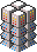
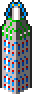

While most buildings operate exactly as described in the game's manual,
some behave in undocumented or unexpected ways. See also
[PAFW and resource deficiency](pafw-and-resource-deficiency.html) for how
buildings fail in a power outage, and [building hitpoints](building-hitpoints)
for how buildings behave when damaged.

### Storage Facility / Storage Tower

{:.right}

If an ore storage building is destroyed, no ore is lost unless the total
amount of ore stored at the asteroid now exceeds the total storage capacity.
When this happens, ore is lost starting with Selenium and going through the
ores in order until capacity is sufficient again.

### Anti-Missile Pod

{:.right}

If an asteroid has at least one Anti-Missile Pod, there is a chance to shoot
down each incoming missile. The chance increases with the number of Anti-Missile
Pods.

The base chance to shoot down each missile is 21% for a single Anti-Missile Pod.
Each additional Pod increases the chance by 2%, if it is fired by the alien; or
4%, if it is fired by the player. The latter generally occurs when firing at
aliens who have Anti-Missile equivalents (Ore Eater's Defence Battery, Rigellian
Defence Battery, and Swixaran Tentacular Defender), but can also occur if the
player fires against themself for some reason.

The chance caps out at 71% for 26 Pods. Aliens cap out at 71% for 14
Pod-equivalent buildings, although they will hit a soft cap before building that
many.

In the CU Amiga K240 demo, Anti-Missile Pods are more effective: 31% base,
+8%/+4% per additional, maxing out at 81%. The player would reach 71% at 11
Pods. However, neither the player nor the alien can build them in the demo. The
numbers are still interesting because it suggests that the building was
intentionally nerfed late in development to make missiles harder to defend
against.

Pods|Terran missile|Alien missile|Terran (demo)|Alien (demo)
----|------|------|------|------
  0 |   0% |   0% |   0% |   0%
  1 |  21% |  21% |  31% |  31%
  2 |  25% |  23% |  39% |  35%
  3 |  29% |  25% |  47% |  39%
  4 |  33% |  27% |  55% |  43%
  5 |  37% |  29% |  63% |  47%
  6 |  41% |  31% |  71% |  51%
  7 |  45% |  33% |  79% |  55%
  8 |  49% |  35% |  81% |  59%
  9 |  53% |  37% |  81% |  63%
 10 |  57% |  39% |  81% |  67%
 11 |  61% |  41% |  81% |  71%
 12 |  65% |  43% |  81% |  75%
 13 |  69% |  45% |  81% |  79%
 14 |  71% |  47% |  81% |  81%
 15 |  71% |  49% |  81% |  81%
 16 |  71% |  51% |  81% |  81%
 17 |  71% |  53% |  81% |  81%
 18 |  71% |  55% |  81% |  81%
 19 |  71% |  57% |  81% |  81%
 20 |  71% |  59% |  81% |  81%
 21 |  71% |  61% |  81% |  81%
 22 |  71% |  63% |  81% |  81%
 23 |  71% |  65% |  81% |  81%
 24 |  71% |  67% |  81% |  81%
 25 |  71% |  69% |  81% |  81%
 26+|  71% |  71% |  81% |  81%

Anti-Missile Pods will fire at missiles that you shoot at your own asteroids,
but will ignore Anti-Virus missile.

Note that the chance to shoot down a missile is unaffected by the rate or number
of missiles incoming. Each missile has the same chance to be shot down, e.g.
there's no advantage in sending cheap Explosive missiles along with a Mega
missile to try and overwhelm the target's anti-missile defences.

### Decontamination Filter

{:.right}

Each Decontamination Filter decreases the radiation at a colony by 30% while
active. It can't permanently erase radiation, although radiation generated by
radioactive ores (Asteros, Traxium and Nexos) goes away when those ores are
mined, which may make the Decontamination Filter unnecessary. See
[health, radiation and population growth](health-radiation-and-population-growth.html).

### Mine, Deep Bore Mine and Seismic Penetrator

{:.right}

Each Mine recovers one ore per 4 days, or one per 2 days with the 2nd Generation
Mines blueprint. Each Deep Bore Mine recovers one every 16 days, or every 8
days with the 2nd Generation Deep Bore Mines blueprint.
Each Seismic Penetrator recovers one ore every 16 days.

The ore mined is chosen at random from the types the mine is compatible with.
If there is none of that ore, the others are tried in order. For example, if an
asteroid has only Selenium and Asteros, 50% of the time a Mine will attempt to
mine Barium or Crystalite and get Selenium instead. This effect applies only to
the Mine and Deep Bore Mine, but not the Seismic Penetrator, e.g. if there is
only Nexos but no Traxium, the Seismic Penetrator will recover Nexos 50% of the
time and do nothing the other 50%.

If there is not enough ore storage capacity at an asteroid, the ore will
not be mined. You cannot waste ore by building mines before storage. However,
due to a Powerplant bug, un-mined Asteros depletes automatically as if by
radioactive decay.

Each mine of any type requires eight colonists as workers. If there are
not enough workers, or the colony's workers are on strike, the mine operates
at 40% efficiency. Each time it would normally
recover an ore, it instead has a random 40% chance to succeed.
In event of a worker shortage, Mines are given precedence over Deep Bore Mines
and Seismic Penetrators.
If the mine is without power, it does not mine any ore.

### Screen Generator

{:.right}

All buildings covered by at least one Screen Generator reduce all damage taken
by 50%, to a minimum of 1 damage. The Screen Generator benefits from its own
protection.

### Gravity Nullifier

{:.right}

In the event of a power outage, the Gravity Nullifier will switch off, but when
power returns, it does not automatically switch back on. It cannot distinguish
between being intentionally turned off by the player and automatically turned
off by power shortage.

### Missile Silo

{:.right}

Every 8 days, one of each missile type on order is built.

Each Missile Silo requires 8 colonists as workers. If there are not
enough workers or the colony's workers are on strike, missile construction
operates at 40% efficiency. Each day, there is only a 40% chance that
one missile will be built. Workers are not required to fire missiles.

### Repair Facility

{:.right}

Each Repair Facility restores one point of damage to each building every eight
days, up to the building's normal maximum. Multiple facilities stack; e.g. if a
colony has five Repair Facilities, it repairs 5 damage to every building once
every 8 days.

If the blueprint Building Armour is available, all buildings' maximum hit points
are increased by 10. A Repair Facility will retroactively apply the new maximum
to buildings constructed before the Building Armour blueprint was purchased.

Small ships in hangars are repaired at the same rate of one point per Repair
Facility every eight days. Contrary to the manual, ships in orbit are never
repaired, and ships in hangars only repair if the colony has a Repair Facility.

Due to a bug, shields are not properly taken into account when repairing ships
(see [bugs](../game-mechanics/bugs.html)). Repair Facility increases a ship's
Armour unless it has either 0 Armour, or the maximum base Armour for its type.
This means a ship with below its base Armour will only repair up to its base
Armour, while a ship with more than base Armour due to shields will increase
above its maximum up to 255 Armour. At 256 Armour it loops back to 0 and is
effectively destroyed.

### Laser, Plasma and Photon Turret

Terran turrets have the following damage output:

| Turret | Damage | With Optimizer |
|:-------|-------:|---------------:|
|      Laser  | 2      |  4             |
|   Plasma | 5      | 10             |
|   Photon | 8      | 16             |

The Turret Optimizer blueprint doubles the damage output of all turrets. Each
Turret fires once every five days, and the cooldown resets on a power outage or
a miss. The turrets on "Protected" buildings operate exactly as a Laser Turret,
including the benefit from Turret Optimizer.

Alien turrets have different (usually higher) damage and different (usually
worse) cooldown timers. See individual alien pages for details. Each alien has
two or three types of turrets, each of which are equivalent to one of the Terran
turret types. They are always just called "TURRET" but can be differentiated by
appearance.

### Asteroid Engines

{:.right}

A [random event](random-events.html) can cause Asteroid Engines to explode,
increasing the colony's radiation level by 10%.

Asteroid Engines require 2-7 power based on current speed (not 0-5 as
described in the manual).

### Powerplant

{:.right}

Un-mined Asteros depletes at a rate of one unit per four days, _even_ if no
Powerplants hae been built. This is probably a bug, although it could be
interpreted as representing the half-life of a radioactive element.

Powerplants run on un-mined ore _in the asteroid_, not in storage. As long as
there is one unit of Asteros left un-mined, every Powerplant on the asteroid
produces 32MW of power. Powerplants do not use up the Asteros or cause it to
deplete any more quickly, no matter how many Powerplants you have.

When Asteros is depleted, the Powerplant produces no power. Although the
manual states that it produces 8MW/day without Asteros, this appears to
be a misinterpretation of the game code, which produces 8MW/day per
C.P.U, the building appearing next to it in the code (since the four-square
buildings appear to have been all added around the same time).

A [random event](random-events.html) can cause a Powerplant to explode,
increasing the colony's radiation level by 10%.

[Issue #12](https://github.com/tetracorp/k240/issues/12) suggests a bugfix to
the Powerplant code.

See the article on why [powerplant is the worst building](../fun/powerplant-sucks.html).

### Command Centre

{:.right}

A Command Centre requires 8 colonists as workers. A worker shortage is likely to
affect only the Command Centre's speed at building an Orbital Space Dock, in
which case it operates at 40% efficiency.

### Construction Yard

{:.right}

In order to make a day's progress toward a construction job, the yard requires
one day's worth of payment from Vehicle Fund. One of each ore is required per day
at the end of the ship's construction, e.g. the last two days of an Assault
Fighter's construction require one Selenium and Crystalite each. If all requirements
are met, the ship is reduced.

Each Construction Yard requires 8 colonists as workers. If there are not
enough workers or the colony's workers are on strike, all yards operate
at 40% efficiency. Each day, there is only a 40% chance that a day's
progress will be made.

There appears to he a maximum of 64 shipyards at any one time. Orbital Space
Docks and Command Centres (producing Orbital Space Docks) may count
toward this limit.

### Landing Pad

{:.right}

Ships landed in hangars do not repair damage unless the colony also has a
Repair Facility.

If a ship is ordered to land on an asteroid's surface, it may pick a Landing Pad
as its landing square. If it does, it will instead land in the hangar.

### Medical Centre

{:.right}

Each Medical Centre reduces the effects of radiation (but not the radiation
level itself) by 10%. In the event of a virus outbreak, a colony also
requires one Medical Centre for every 100 full colonists after the first 50
in order to end the outbreak.

See [health, radiation and population growth](health-radiation-and-population-growth.html).

### Security Centre

{:.right}

A colony needs one Security Centre for every full 100 colonists after the
first 50 to prevent social unrest.
See [security and morale](security-and-morale.html).

### "Protected" buildings

{:.right}

In addition to the laser turret attached to the
Protected Resiblock, Protected Solar Matrix, and Protected Environment Control,
these buildings have higher hit points than their non-protected counterparts
(see [building hitpoints](building-hitpoints.html)). Protected Storage Tower does not.

If a power shortage causes Laser Turrets to fail, all turrets on Protected
buildings also fail.
