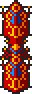
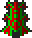
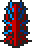
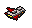
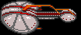
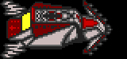
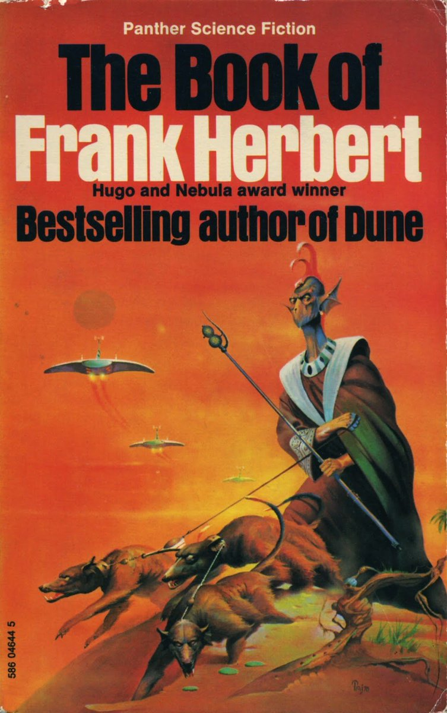

{:.right width="128px" height="56px"}

{:.right width="160px" height="210px"}

The Kll-Kp-Qua are the default alien in K240, and generally considered the
easiest.

1. Table of Contents
{:toc}

### Unique traits

The Kll-Kp-Qua are immune to radiation. They have no buildings to reduce
radiation, and suffer no penalty due to radiation. Nor do they have any specific
buildings for air or water.

### Buildings

Each alien building has a name, a type (as it counts on a spy satellite report),
Hit Points, build time (in days), a height (for the purpose of scaffold), a
width (1, for one-square, or 4 for a 2x2 building), a softcap (buildings marked
! have a hard cap instead), and the building at the equivalent position in the
Terran building list.

| Name                      | Type    |  HP |  BT | H | W |  Cap | Equivalent
|:--------------------------|:--------|----:|----:|--:|--:|-----:|:-----------------------
| Hive                      | General |   8 |  10 | 3 | 1 |    4 | Living Quarters
| Power Store               | Power   |  16 |   8 | 1 | 1 |    2 | Power Store
| Ore Storage Chamber       | General |   8 |  10 | 1 | 1 |    1 | Storage Facility
| Power Collector           | Power   |   5 |   5 | 2 | 1 |    3 | Solar Panel
| Science Hive              | General |  16 |  35 | 3 | 1 |    1 | ~~Decontamination Filter~~
| Weapon Plant              | Offense |  20 |  18 | 1 | 1 |    1 | Weapons Factory
| Mine                      | General |  15 |  14 | 3 | 1 |    3 | Mine
| Screen Generator          | Defence |  28 |  45 | 2 | 1 |    1 | Screen Generator
| Missile Bay               | Offense |  10 |  24 | 0 | 1 |    3 | Missile Silo
| Communications Tower      | General |  32 |  40 | 3 | 1 |    1!| ~~Sensor Array~~
| Turret                    | Offense |  20 |  30 | 1 | 1 |    1 | Plasma Turret
| Turret                    | Offense |  20 |  20 | 2 | 1 |    2 | Photon Turret
| Data Hive                 | General |  15 |  50 | 3 | 4 |    1 | ~~Seismic Penetrator~~
| Power Converters          | Power   |  28 |  25 | 3 | 4 |    1 | Powerplant
| Queen's Chamber           | General | 100 |  16 | 3 | 4 |    1!| Command Centre
| Ship Construction Factory | Offense |  28 |  20 | 2 | 4 |    2 | Construction Yard
| Landing Pad               | General |   8 |  12 | 0 | 1 |    3 | Landing Pad
| Turret                    | Offense |  16 |  16 | 1 | 1 |    3 | Laser Turret
| Hibernation Hive          | General |  32 |  16 | 3 | 1 |    1 | Resiblock
| Protein Plant             | General |  20 |  10 | 3 | 1 |    2 | Hydroponics

Communications Tower
: {:.left}  Unknown at this time. No more than one can be built in one asteroid.

Data Hive
: {:.left}  Increases the chance that the colony will spot a Terran spy satellite. The
colony has a cumulative 1% chance per day to spot one spy satellite, with a base
rate of 1 attempt per day. Each Data Hive grants an additional attempt per day.

Hibernation Hive
: {:.left}  If the colony growth (+5 population per day) would put the population over
Hive capacity, 2 new population per day instead go to the Hibernation Hive. Each
stores 600 population. Colony ships draw from hibernation.

Hive
: {:.left}  Each hive increases the population capacity by 200. If the last Hive is
destroyed, the colony is destroyed.

Landing Pad
: {:.left}  At least one of these is required to build ships.

Mine
: {:.left}  Required to mine ore, although they do not need to spend ore to build
anything. At least one mine _or_ Ore Storage Chamber is required to build ships.
Capable of mining all ten ores.

Missile Bay
: {:.left}  {:.left}
Required to build and launch missiles.

Ore Storage Chamber
: {:.left}  At least one of these _or_ one mine is required to build ships. Does not
actually track how much ore has been mined.

Power Collector
: {:.left}  Must have one of these _or_ a Power Converters to mine ore.

Power Converters
: {:.left}  Must have at least one of these to build ships or missiles. Must have one of
these _or_ a Power Collector to mine ore.

Power Store
: {:.left}  Unknown at this time.

Protein Plant
: {:.left}  Required to sustain population. If there is no Protein Plant, population
decreases by 1 each day and build priority is set to cluster 6 (two Hives,
Hibernation Hive, and Protein Plant){:.left}.

Queen's Chamber
: {:.left}  The strongest building in the entire game, with 100 hit points. Technically
equivalent to the Terran Command Centre, rather than the CPU: no alien builds a
CPU, since they establish clusters of four buildings to start a colony. Human
players prefer to build their colony themselves. If the Queen's Chamber is
destroyed, the colony is destroyed. Only one is built when the colony is
established.

Science Hive
: {:.left}  Identical in function to the Data Hive. However, the alien will never
actually build this.

Screen Generator
: {:.left}  Appears to work in a similar fashion to the Terran screen generator, but
further analysis is required to determine if there any differences. The standard
screen generator halves damage; with this, the Queen's Chamber must take the
equivalent of 200 damage to be destroyed.

Ship Construction Factory
: {:.left}  At least one of these is required to build ships. Maximum of 4 per colony.
Can build large ships too.

Turret
: {:.left}  Laser turret. Deals 2 damage, same as the Terran turret.
Fires on an 8-day cooldown.

Turret
: {:.left}  Plasma turret. Deals 4 damage, 20% weaker than its Terran equivalent.
Fires on an 8-day cooldown.

Turret
: {:.left}  Photon turret. Deals 6 damage, 25% weaker than its Terran equivalent.
Fires on an 8-day cooldown.

Weapon Plant
: {:.left}  At least one of these is required to build ships or missiles.

### Building strategy

Each Kll-Kp-Qua colony attempts a new build every 60 days. They do not require
any currency or resources to do so. Unless there is an urgent need, they will
randomly attempt to build one of the following clusters of four buildings:

* 0: Turret (Laser), Turret (Photon), Power Collector, Missile Bay
* 1: Queen's Chamber, Hive, Power Converters, Protein Plant
* 2: Turret (Laser), Data Hive, Communications Tower, Power Collector
* 3: Ship Construction Factory, Landing Pad, Landing Pad, Weapon Plant
* 4: Mine, Mine, Ore Storage Chamber, Power Collector
* 5: Power Converters, Power Store, Power Store, Power Collector
* 6: Hive, Hibernation Hive, Hive, Protein Plant
* 7: ---, Turret (Plasma), Missile Bay, Screen Generator

That building on #7 is a dummied-out Kll-Kp-Qua deleted building. Its equivalent
in the Terran building list is the Anti-Missile Pod.

If they attempt to build something which has already reached the soft cap for
that building, there is a 20% chance they will ignore it and build it anyway.
Exceptions are the Queen's Chamber and Communications Tower, which are hard
capped at 1 per colony.

They will build Cluster 6 instead of random if there is no Protein Plant, and
Cluster 5 if there is no Power Converters or Power Collector.

### Missiles

Each Kll-Kp-Qua asteroid attempts to build new missiles every 25 days. They must
have a Power Converters, Weapon Plant, and Missile Bay. If so, they roll on the
following percentile table and build that missile, unless they already have 5 of
that missile. No ore or currency is required. The "Yield" here is what it shows
as on a spy satellite survey.

| Missile        | Build  | Yield |
|----------------|-------:|------:|
| Explosive      |   39%  | Low   | 
| Area Explosive |   28%  | Med   | 
| Scatter        |   12%  | High  | 
| Napalm         |   7%   | Med   | 
| Virus          |   6%   | Other | 
| "Bioweapon"    |   5%   | Low   | 
| Nuclear        |   3%   | High  | 

"Bioweapon"
: A special missile replaces Vortex on the Kll-Kp-Qua's list. It is unique to
that race, and causes a blue flash and rare sound. Its effect is to reduce the
population of the target asteroid by 20. It is rarely a threat since they only
have a 5% chance to build one each time and only to a maximum of 5 per asteroid,
meaning it can only reduce your population by 100 per missile strike.

Trivia: 

* Kll-Kp-Qua are the only alien to use Napalm missile.
* The Kll-Kp-Qua is the only alien for whom Scatter is listed as High yield. All
  other aliens list is as Medium.
* They will not build Hellfire, Mega, Stasis, Vortex or Antivirus.

### Ships

To build ships, the Kll-Kp-Qua colony requires at least one Power Converters,
Landing Pad, and Weapon Plant. It also requires at least one Mine or Ore Storage
Chamber. They require at least one Ship Construction Factory, and production
speed increases with additional factories, up to a maximum of four.

Each ship an Armour value, speed, number of hardpoints (sometimes erroneous), ID
number in the game code, chance to build, build time, and up to six hardpoints.
The names here are arbitrary and do not appear in the code.

Name            | Armour| S | H | ID | Bld%  | Days  | HP1| HP2| HP3| HP4| HP5| HP6|
----------------|------:|--:|--:|:---|------:|------:|----|----|----|----|----|----|
"Fighter"       |    10 | 2 | 1 | 3c | 16%   | 35    | 06 | 0b |    |    |    |    |
"Light Warship" |    20 | 2 | 3 | 3d | 40%   | 35    | 06 | 00 | 05 |    |    |    |
"Tanker"        |    80 | 1 | 0 | 3e | 16%   | 30    |    |    |    |    |    |    |
"Scoutship"     |    10 | 2 | 1 | 3f | 11%   | 15    | 05 |    |    |    |    |    |
"Heavy Warship" |    40 | 1 | 4 | 40 |  8%   | 45    | 05 | 06 | 02 | 01 |    |    |
"Rotator"       |    20 | 0 | 0 | 41 |  5%   | 20    |    |    |    |    |    |    |
"Transporter"   |    20 | 0 | 2 | 42 |  2%   | 95    | 00 | 07 |    |    |    |    |
"Battleship"    |    60 | 0 | 6 | 43 |  2%   | 95    | 05 | 06 | 00 | 01 | 0a | 02 |

Ship $3c "Fighter"
: {:.left}
A small ship with 10 Armour and two hardpoints: a Photon Cannon (6 damage) and a
unique hardpoint $0b, whose effect is uncertain but appears to cause the ship to
move (perhaps to another colony) and patrol. The game code describes it as
having one hardpoint, but it has two if this unique hardpoint is included.

Ship $3d "Light Warship"
: {:.left}
A small ship with 20 Armour. It has a Photon Cannon (6 damage), an Ion
Cannon, and a Laser Cannon (2 damage).

Ship $3e "Tanker"
: {:.left}
A slower ship with 80 Armour and no hardpoints. Its purpose is unknown.

Ship $3f "Scoutship"
: {:.left}
A scout ship with 10 Armour and one hardpoint, a Laser Cannon (2 damage).
Each colony sends out a scout ship every 70 days.

Ship $40 "Heavy Warship"
: {:.left}
A slower combat ship with 40 Armour and 4 hardpoints: a Laser Cannon (2
damage), Photon Cannon (6 damage), a Disruptor and a Napalm Orb.

Ship $41 "Rotator"
: {:.left}
An immobile rotating triangular station with 20 Armour and no hardpoints. It
grants one addition chance per 16-day check to spot spy satellites, same as a
Data Hive.

Ship $42 "Transporter"
: {:.left}
A transporter with 20 Armour and two hardpoints: an Ion Cannon, and a
Plasma Cannon (4 damage). Only ship of this race equipped with Plasma Cannon.

Ship $43 "Battleship"
: {:.left}
A battleship with 60 Armour. Its six hardpoints are a Laser Cannon (2 damage),
a Photon Cannon (6 damage), an Ion Cannon, a Disruptor, a Deflector, and a
Napalm Orb. The Deflector halves damage it takes, effectively giving it 120
Armour.

### Starting resources

When fighting the Kll-Kp-Qua, the Terran player starts with:

* Cash: 400,000 credits
* Blueprints: Gravity Nullifier
* Guaranteed first event: Reinforcements (60 days; although if the player has
  not entered the Manual Protection Code, that event will precede it)

The initial Kll-Kp-Qua colony has the following building clusters:

* 1: Queen's Chamber, Hive, Power Converters, Protein Plant
* 3: Ship Construction Factory, Landing Pad, Landing Pad, Weapon Plant
* 7: ---, Turret (Plasma), Missile Bay, Screen Generator

They begin with the following ships:

* $3f Scoutship x1
* $42 Transporter x1

### Colonization strategy

Each Kll-Kp-Qua asteroid has a 100% chance to attempt to start a new colony once
every 200 days. It takes 80 days for the initial colony to begin functioning,
and 40 days for each new colony.

Unlike the Terran player, Kll-Kp-Qua colony ships actually carry civilians. The
transporter loads up to 200 colonists from the Hibernation Hive, quietly
rounding that number up to 50 if it's lower.

When the Kll-Kp-Qua start a new colony, they build the following cluster of four
buildings necessary for survival:

* 1: Queen's Chamber, Hive, Power Converters, Protein Plant

### Mining strategy

Every other day, as long as there is at at least one Mine, and least one of
either Power Collector or Power Converters, the Kll-Kp-Qua can mine. They mine
one unit of five randomly chosen ores. They do not need Ore Storage Chamber to
mine, nor does anything track the amount of ore they have mined, although it
will deplete the asteroid of ore as normal.

### Population

Population grows by 5 per day, as long as there is at least one Protein Plant.
If there are no Protein Plants, population instead decreases by 1 per day. Each
Hive can store 200 population. If population would exceed Hive capacity, two
population are added to hibernation, with a capacity of 600 Hibernation Hives.
It is probable that hibernating population are not counted in Intel reports.
The colony must have at least one Queen's Chamber or Hive or be destroyed.

### Spying

Each colony has a daily chance to spot one Terran spy satellite in orbit and
shoot it down. The chance begins at 1% and increases by 1% per 16 days. Once
they shoot a satellite down, the chance drops to 6%.

The daily chance is increased by 1% per 16 days for each Data Hive and each of
the triangular rotating ships.

### Scouting

Every 70 days, each colony sends a scout ship to explore a random sector of space.

### Tactical

The last minute intelligence says "Look for the pattern in the enemy attacks. It
is very predictable." Is it?

Each established Kll-Kp-Qua colony has a 16-pixel sensor range for detecting
missiles. If a Terran missile or spy satellite passes through sensor range, even
if it isn't targeting an alien asteroid, the alien retaliates with a missile
strike. The retaliation is performed by a random alien colony, and against a
random Terran colony. Subsequent retaliations are delayed by twelve days divided
by the number of established alien colonies. A single missile strike can trigger
multiple retaliations if it remains within alien sensor range for longer than
this.

The retaliatory strike consists of a quarter of its missiles, maximum 10, chosen
at random. In practice, they only have a maximum of 5 of each of 7 types, the
maximum will be 8. Following a retaliatory launch, the chance of spotting a spy
satellite in orbit (if there are any) increases by 1%. An 8-day timer is set,
probably for a graphical or audio effect.

Each colony has a 40 pixel sensor range for detecting fleets. Every 16 days, if
a fleet is detected, the colony will build a new defensive fleet of 0 to 14
ships, provided there are at least 8 ships at the asteroid. If there are no
Terran fleets detected in range, they will instead build an offensive fleet of 0
to 19 ships, provided there are at least 15 ships available. If there are no
ships available, they will instead attack a random colony with missiles as
above.

### Art inspiration

{:width="180px"}
{:.right}

The design of the Kll-Kp-Qua appears to be inspired heavily by an artwork by
science fiction illustrator Peter A. Jones, which graces the cover of Panther
UK's 1973 publication of _The Book of Frank Herbert_ (ISBN 0-586-04644-5). It is
a collection of ten short stories.
It appeared on page 45 of Jones' 1980 art anthology, _Solar Wind_.

The individual depicted in that artwork appears in the short story _The Gone
Dogs_, which originally appeared in _Amazing Stories_, November 1954. He is a
Vegan, a seven-fingered alien species from the Vega star system:

> "When Trent arrived at his bachelor apartment that night he found a visitor, a
> tall (almost seven feet) Class C humanoid, head topped by twin, feather-haired
> crests, eyes shaded by slitted membranes like Venetian blinds. His slender
> body was covered by a blue robe, belted at the waist."

The lore for the species is written separately, and is unrelated to the original
story. For example, in the original story, the head plumage seems to be part of
the creature's body, whereas in the K240 manual it's described as a form of
dress. Both species wear robes, but in the they are taller than humans, whereas
in K240 they are less than 1 meter.

Peter Andrew Jones isn't credited in the game for his contribution, but
according to his
[Mobygames profile](https://www.mobygames.com/person/35851/peter-andrew-jones/credits/)
he did provide some cover artwork for various games in the late 1980s and early
1990s, including several Amiga games. In some cases his 1970s sci-fi cover art
was later licensed for use in the game industry; for example, his 1974 cover art
of [King Kobold](https://www.isfdb.org/cgi-bin/title.cgi?1391146) was used for
the 1992 DOS game [The Big 100](https://www.mobygames.com/game/69737/the-big-100/).

Below is a comparison between the alien as it appears in the game, and the
artwork:

