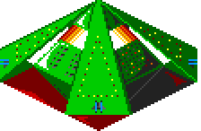

Here are a few bugs which appear in the game.

Several of these bugs are fixed in the unofficial K240 patch,
[K240-Bugfix](https://github.com/drDragonSmoke/K240-Bugfix).

### Ship repair bug

Repair Facility fails to properly account for shields when repairing ships. This
allows small ships in hangars to increase their Armour well above their maximum.
It can also prevent damaged small ships from restoring Armour granted by
shields.

Once every eight days, each
[Repair Facility](../game-mechanics/building-behaviour.html#repair-facility)
repairs one Armour to every small ship in hangars. Before incrementing a ship's
Armour, it makes two checks: that the ship does not have 0 Armour, and that the
ship is not currently equal to its base maximum for its class.

However, it does not account for ships with shields, which start with above
their base maximum. This has two effects.

- Ships damaged below the base Armour will only repair up to their base Armour.
- Ships with above their base Armour thanks to shields will repair up to 255. At
  256, it loops back to 0 and the ship will no longer repair, and the game will
  effectively consider it destroyed.

For example, a Scoutship normally has 5 Armour. Repair Facility will add 1 to a
Scoutship's Armour as long as it does not have 0 or 5 HP. If a Scoutship has
Shield x30 as its hardpoint, it begins at 35 Armour and will repair to 36, 37,
38, and so on up to 255 if it stays long enough in hangars. However, if it is
ever damaged to 5 or below, it will never repair above 5.

A screenshot on the back of the K240 game box shows small ships with impossibly
high Armour values. This may be an example of the bug. The two non-small ships
shown are Transporters with 110 and 130 Armour, respectively, both of which are
legitimately possible on self-built Transporters with shields in both slots.

Thanks to drDragonSmile for discovering this bug
([issue #11](https://github.com/tetracorp/k240/issues/11) on the issue tracker)
as recently as 2023, and successfully implementing a bugfix. If you'd like to
implement the same fix, open the file `playk240` in a hex editor and go to
byte offset `0x15e6e` (decimal `89,710`) and change the bytes `6702` to `6f02`.
This changes the check from BEQ to BLE, i.e. `==` to `<=`, and prevents
over-repair. However, repairs are still capped to the base value without
shields.

### Fleet bug

Fleets will sometimes appear to jump from one asteroid to another, followed by a
game crash.

This bug is present in the initial v1.886 release
(see [version history](../history/version-differences.html)
and [development and release history](../history/development.html)),
but analysis of the code suggests that a change to fix it appeared in the
June 1994 v2.000 update. This appears to be the only change
made in that version, aside from an updated version string.

### Asteros depletion bug

Asteros depletes from a colonized asteroid at a rate of one unit per four days,
even if no Mines have been built. This occurs in the Powerplant code, suggesting
it was meant to reflect the Powerplant using Asteros ore, but the code is bugged
and it just depletes Asteros.

See [Powerplant](../game-mechanics/building-behaviour.html#powerplant) for more
details.

[Issue #12](https://github.com/tetracorp/k240/issues/12) suggests a bugfix.

### Alien scaffold bug

{:.right}

Clicking on an alien scaffold while in "flat" building mode sometimes causes
junk to appear on screen instead of a building name.

### Yards need more Bytanium

{:.right}

When building a ship, the construction window sometimes incorrectly reports a
shortage of ore, although construction will proceed normally.

The game gradually deducts ore during the ship's construction process. However,
it reports an error if at any point there is insufficient ore to cover the
total requirements.

For example, the Orbital Space Dock requires 10 Bytanium and 20 Dragonium.
Suppose you sell all but 10 Bytanium, because nothing in the game but an OSD
requires Bytanium, and start construction on an OSD. Once you're down to 9
Bytanium in stores, the OSD will complain that there's not enough, because
there's less than 10. However, construction will proceed normally.

### Photon or Plasma?

 
{:.right}

The game is inconsistent as to whether photon or plasma is the most powerful. In
turret buildings, Photon is described as superior to Plasma, and the game code
confirms this (Photon deals 8 damage, Plasma 5 damage, and Laser 2 damage).

However, with ship hardpoints, Plasma (9000 CR) costs more than Photon (4500
CR) and is described in the manual as superior. The game code confirms that this
is a mistake: Photon Cannon, despite being cheaper, is more powerful. The ship
cannons deal exactly the same damage as their turret counterparts.

See [Photon vs Plasma](photon-plasma.html) for an in-depth look at this.

### Wrong blueprint

The blueprints of the Static Inducer and Warp Generator don't match their
appearance in in the build window.

In the Sci-Tek screen, the cross-shaped hardpoint is the Static Inducer, while
the more cannon-shaped item is the Warp Generator. Note the Warp Generator's
reference to "cloak sequencer" in the graphic. In the Construction Yard screen,
they are swapped.

### Minor typos

In the missile build screen, "AREA EXPLOSIVE." has a full stop at the end of its
name, but no other missile does.

The game consistently misspells _hangar_ as _hanger_. This typo previously
appeared in Graeme Ing's previous game _BSS Jane Seymour_, aka _Spacewrecked_
([see video](https://www.youtube.com/watch?v=1gg53dWjinw)).

{:.right}

The language select screen reads English, "Francais", and "Deutsche". The last
two should correctly be spelled Français and Deutsch.

The blueprint purchase screen reads "THANKYOU", which shouldbe two words, "THANK
YOU".

### Selenium calculation bug

A small bug appears to generate the amount of Selenium incorrectly.

As mentioned in [asteroids and ore](../game-mechanics/asteroids-and-ore.html),
each asteroid has a percentage chance to have each ore. The amount of each ore
is randomly chosen between a minimum and maximum value. It's calculated using
the formula `min+rand(1+max-min)`, where `rand(n)` is a function that selects a
random integer between zero and n-1.

However, for Selenium, the maximum amount (100) is lower than the minimum (500),
resulting in calling `rand(-399)`. Despite this, the random function effectively
treats negative input values as positive. This returns a random value from 0 to
398, giving a range from 500 to 898.

### Missile sprite animations missing

 
 
 
 
{:.right}

Missile sprites only appear on the missile build screen. However, since the game
is paused in build screens, animations also freeze. In fact, missile sprites for
Scatter, Virus, Stasis and Antivirus have animations, which the player never
sees.

All missile animations and most sprite animations are handled using palette
colors 14 and 15, which alternate between #700 and #FF2 (dark red and yellow,
respectively). This trick is also used to animate ship engines, the Static
Inducer effect, the blinking lights on ships and buildings, and even the
animation of the Mine and Deep Bore Mine.
