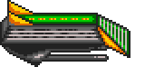

{:.right width="128px" height="116px"}

{:.right width="288px" height="146px"}

The Ore Eaters, also called the Lak'Maj'Traal, are one of the easier aliens in
K240.

1. Table of Contents
{:toc}

### Unique traits

The Ore Eaters literally consume ore. They need mines or ore storage buildings
for population growth, and are the only alien to lack an equivalent to the
Terran Hydroponics building. They only lose one colonist per day without life
support, and are unaffected by radiation. In optimal circumstances, population
growth is 2 per day.

If you colonize an asteroid which had an Ore Eater colony, the asteroid
explodes.

Despite a claim in the game manual that the Ore Eaters only attack mining
colonies, they still attack colonies without any mining equipment.

### Buildings

Each alien building has a name, a type (as it counts on a spy satellite report),
Hit Points, build time (in days), a height (for the purpose of scaffold), a
width (1, for one-square, or 4 for a 2x2 building), a softcap (buildings marked
! have a hard cap instead), and the building at the equivalent position in the
Terran building list.

| Name                      | Type    |  HP |  BT | H | W |  Cap | Equivalent
|:--------------------------|:--------|----:|----:|--:|--:|-----:|:-----------------------
| Civilian Dome             | General |  22 |  18 | 0 | 1 |    4 | Living Quarters
| Capacitor                 | Power   |  22 |  20 | 0 | 1 |    2 | Power Store
| Ore Depot                 | General |  24 |  16 | 0 | 1 |    4 | Storage Facility
| Defence Battery           | Defence |  32 |  36 | 1 | 1 |    8 | Anti-Missile Pod
| Science Dome              | General |  20 |  32 | 0 | 1 |    1!| ~~Decontamination Filter~~
| Military Research Dome    | Offense |  32 |  36 | 0 | 1 |    1 | Weapons Factory
| Robotic Mining Drill      | General |  20 |  26 | 0 | 1 |    6 | Mine
| Shield Generator          | Defence |  32 |  53 | 3 | 1 |    1 | Screen Generator
| Advanced Mining Drill     | General |  20 |  36 | 1 | 1 |    4 | Deep Bore Mine
| Rocket Battery            | Offense |  15 |  20 | 0 | 1 |    4 | Missile Silo
| Detection Cluster         | General |  16 |  20 | 1 | 1 |    1!| Sensor Array
| Turret                    | Offense |  24 |  35 | 0 | 1 |    2 | Plasma Turret
| Turret                    | Offense |  24 |  42 | 0 | 1 |    2 | Photon Turret
| Environment Processor     | General |  32 |  36 | 0 | 1 |    2 | Life Support
| Turbine Array             | Power   |  32 |  48 | 1 | 4 |    1 | Powerplant
| Command Bunker            | General |  40 |  44 | 1 | 4 |    1!| Command Centre
| Launch Facility           | Offense |  24 |  40 | 1 | 4 |    2 | Construction Yard
| Turret                    | Offense |  24 |  25 | 0 | 1 |    4 | Laser Turret

Advanced Mining Drill
: {:.left} Mines two random units of the last five ores (Bytanium, Korellium, Dragonium,
Traxium, or Nexos) per day. Only half the number of Advanced Mining Drills
(rounded down, minimum zero) will function without a Command Bunker. Colony will
additionally mine two of the last five ores without any advanced drill. At least
one of either mine or Ore Depot is required for population growth (2/day) or to
build ships.

Capacitor
: {:.left} At least one Turbine Array or Capacitor is required to mine any ore.

Civilian Dome
: {:.left} Housing, required for colony life. If there is not at least one, the colony is
destroyed. Each dome houses up to 100 population.

Command Bunker
: {:.left} One is built at colony start, and no more than one at a time will be built.
Required to give the order to establish a new colony. The effectiveness of all
mines is halved without a Command Bunker.

Defence Battery
: {:.left} Has a 21% chance to shoot down incoming missiles. Each additional battery
after the first adds an additional 4% chance, for a maximum of 71% at 14 pods,
although the Ore Eaters will only build 8 before hitting a soft cap.

Detection Cluster
: {:.left} Increases the chances of spotting Terran spy satellites. The base chance is 1%
plus a cumulative 1% per day, and each additional Detection Cluster adds another
chance per day.

Environment Processor
: {:.left} Equivalent to Life Support, required for colony life. If there is not at least
one Environment Processor, the colony loses 1 colonist per day. Required for
population growth.

Launch Facility
: {:.left} Construction Yard. Required to build ships. Caps out at two launch facilities.
Each is used to construct an orbital station.

Military Research Dome
: {:.left} Required to build missiles or ships.

Ore Depot
: {:.left} At least one depot or drill is required for population growth or to build
ships. Does not track the amount of mined ore, since aliens do not use ore.

Robotic Mining Drill
: {:.left} Mines two random units of the first five ores (Selenium, Asteros, Barium,
Crystalite, Quazinc) per day. Only half the number of Robotic Mining Drills
(rounded down, minimum zero) will function without a Command Bunker. Colony will
additionally mine two of the first five ores without any robotic drill. At least
one of either mine or Ore Depot is required for population growth (2/day) or to
build ships.

Rocket Battery
: {:.left} {:.left} Required to launch or build missiles.

Science Dome
: {:.left} Unknown. A colony will never build more than one Science Dome.

Shield Generator
: {:.left} Operates similarly to a Terran shield generator.

Turbine Array
: {:.left} At least one Turbine Array or Capacitor is required to mine any ore. If
neither exist, build priority will be set to Cluster 1, which includes Turbine
Array. Turbine Array is required to build missiles or ships. One Turbine Array
is built at colony start.

Turret
: {:.left} Laser turret. Deals 2 damage, the same as its Terran equivalent. Fires on a
6-day cooldown.

Turret
: {:.left} Plasma turret. Deals 4 damage, 20% weaker than its Terran equivalent. Fires on
a 6-day cooldown.

Turret
: {:.left} Photon Turret. Deals 6 damage, 25% weaker than its Terran equivalent. Fires on
a 6-day cooldown.

### Building strategy

Each Ore Eater colony attempts a new build every 60 days. They do not require
any currency or resources to do so. Unless there is an urgent need, they will
randomly attempt to build one of the following clusters of four buildings:

* 0: Robotic Mining Drill, Robotic Mining Drill, Ore Depot, Advanced Mining Drill
* 1: Civilian Dome, Command Bunker, Turbine Array, Environment Processor
* 2: Turret (Laser), Turret (Photon), Turret (Plasma), Rocket Battery
* 3: Civilian Dome, Capacitor, Capacitor, Turbine Array
* 4: Military Research Dome, Science Dome, Rocket Battery, Detection Cluster
* 5: Shield Generator, Launch Facility, Defence Battery, Capacitor
* 6: Robotic Mining Drill, Ore Depot, Civilian Dome, Environment Processor
* 7: Robotic Mining Drill, Ore Depot, Defence Battery, Turret (Laser)

If they attempt to build something which as already reached the soft cap, there
is a 10% chance they will ignore the cap and build anyway. This is the lowest
chance of any alien. They will never build more than 1 Command Bunker, Detection
Cluster, or Science Dome.

If there is not at least one Environment Processor, they will set priority to
build Cluster 1 (Civilian Dome, Command Bunker, Turbine Array, Environment
Processor). If there is not at least one Turbine Array or Capacitor, they will
set priority to build Cluster 1.

### Missiles

Each Ore Eater asteroid attempts to build new missiles every 35 days, the
slowest of any alien. They must have a Turbine Array, Military Research Dome,
and Rocket Battery. If so, they roll on the following table and build that
missile, to a maximum of 5 of that missile. No ore or currency is required. The
"Yield" listed is what shows on a spy satellite survey.

| Missile         | Build  | Yield |
|-----------------|-------:|------:|
| Explosive       |  32%   | Low   |
| Area Explosive  |  22%   | Med   |
| Scatter         |  15%   | Med   |
| "Transmutation" |  10%   | Med   |
| "Earthquake"    |  8%    | High  |
| "Ore Virus"     |  5%    | Other |
| Stasis          |  3%    | Other |
| Nuclear         |  3%    | High  |
| Mega            |  2%    | High  |

"Ore Virus"
: As standard Virus, but also converts random ores into Selenium. One unit is
converted every 5 days. Does not spread like normal Virus. If they later
colonize that asteroid, this effect is cleared.

"Earthquake"
: A special missile which replaces the Vortex. Considered high yield.
Deals 14 damage to every building. Causes a screen-shake effect.

"Transmutation"
: A special missile which replaces Anti-Virus. Melts a single random building
instantly, then increases the amount of ore at the asteroid. That asteroid gains
a random amount of 100 - 299 ore, to a maximum of 1,000 ore, of a type randomly
chosen from Selenium, Asteros, Barium and Crystalite. Yes, this missile
literally gives the player free ore (until the Ore Eaters take your colony; then
it's their ore).

Trivia:

* The Ore Eaters do not use Napalm or Hellfire. They don't build Vortex or
  Anti-Virus, since those slots are used for unique missiles.

### Ships

Ship construction requires at least one Turbine Array and one Military Research
Dome. It also requires one Robotic Mining Drill, Advanced Mining Drill, or Ore
Depot. It requires at least one Launch Facility, and builds twice as fast if it
has two of those, but does not benefit from more than two. The triangular
orbital station ship appears to construct ships in a similar manner to the
Orbital Space Dock.

Each ship an Armour value, speed, number of hardpoints (sometimes erroneous), ID
number in the game code, chance to build, build time, and up to six hardpoints.
The names here are arbitrary and do not appear in the code.

Name                  | Armour| S | H | ID | Bld%    | Days     | HP1| HP2| HP3| HP4| HP5| HP6|
----------------------|------:|--:|--:|:---|--------:|---------:|----|----|----|----|----|----|
"Fighter"             |    20 | 2 | 1 | 3c | 10%     | 55       | 06 |    |    |    |    |    |
"Light Cruiser"       |    30 | 2 | 2 | 3d | 42%     | 55       | 06 | 00 | 05 |    |    |    |
"Heavy Cruiser"       |    30 | 1 | 2 | 3e | 15%     | 65       | 06 | 05 | 00 | 02 |    |    |
"Scoutship"           |    20 | 2 | 1 | 3f | 15%     | 30       | 06 |    |    |    |    |    |
"Heavy Bomber"        |    40 | 1 | 5 | 40 | 10%     | 65       | 05 | 06 | 04 | 01 | 0a |    |
"Orbital Station"     |    50 | 0 | 0 | 41 | &mdash; | &mdash;  |    |    |    |    |    |    |
"Transporter"         |    25 | 0 | 2 | 42 |  3%     | 90       | 02 | 06 |    |    |    |    |
"Battleship"          |    70 | 0 | 6 | 43 |  5%     | 110      | 07 | 06 | 08 | 01 | 0a | 03 |

Ship $3c "Fighter"
: {:.left}
A small 20 Armour ship with one hardpoint: a Photon Cannon (6 damage).

Ship $3d "Light Cruiser"
: {:.left}
A small 30 Armour ship with three hardpoints: a Photon Cannon (6 damage), Ion
Cannon, and Laser Cannon (2 damage). The game code lists it as having only two
hardpoints.

Ship $3e "Heavy Cruiser"
: {:.left}
A slower 30 Armour ship with four hardpoints: a Photon Cannon (6), Laser Cannon
(2), Ion Cannon, and Napalm Orb. However, the game code lists it as having only
two hardpoints. Practically identical to ship $3d except for the additional
Napalm Orb and reduced movement speed.

Ship $3f "Scoutship"
: {:.left}
A small 20 Armour ship with one hardpoint: a Photon Cannon (6 damage).
Each Ore Eater colony sends out a scoutship every 30 days, the fastest of any
alien.

Ship $40 "Heavy Bomber"
: {:.left}
A medium ship with 40 Armour and 5 hardpoints: Laser Cannon (2), Photon Cannon
(6), Vortex Mine, Disruptor, and a Deflector. The Deflector halves all damage,
effectively giving it 80 Armour. Since this alien doesn't use Vortex missiles,
this is the only thing which can cause Vortex.

Ship $41 "Orbital Station"
: {:.left}
An immobile diamond-shaped ship with 50 Armour and no hardpoints. Serves as a
Construction Yard for producing ships.

Ship $42 "Transporter"
: {:.left}
A large ship with 25 Armour and two hardpoints: a Napalm Orb, and a Photon
Cannon (6).

Ship $43 "Battleship"
: {:.left}
A large ship with 70 Armour and six hardpoints: a Plasma Cannon (4 damage), a
Photon Cannon (6 damage), a Static Inducer, a Disruptor, a Deflector, and a
Chaos Bomb. The Deflector halves all damage, effectively giving it 140 Armour.
If you encounter a Static Inducer against this alien, this is the cause.

### Starting resources

When facing the Ore Eaters, the player starts with the following resources:

* Cash: 300,000 credits
* Blueprints: Gravity Nullifier
* Guaranteed first event: Reinforcements

The alien colony has the following building clusters:

* 1: Civilian Dome, Command Bunker, Turbine Array, Environment Processor
* 0: Robotic Mining Drill, Robotic Mining Drill, Ore Depot, Advanced Mining Drill

They begin with the following ships:

* $3d "Light Cruiser" x6
* $3e "Heavy Cruiser" x4
* $3f "Scoutship" x1
* $42 "Transporter" x1

### Colonization strategy

Each Ore Eater asteroid considers starting a new colony every 30 days, the
fastest of any alien. There is only a 5% chance of starting a new colony, but
this rises to 50% if there is less than 50 total ore at the current asteroid. If
there is no Command Bunker, the colonization countdown freezes until one is
built.

A colony ship carries 50 population, although it does not actually decrease the
existing number of citizens.

The Ore Eaters will clear a virus-infected asteroid when they colonize it. This
is useful, since their Virus missile has the special property of gradually
transforming other ores into Selenium, and they are unaffected by radiation.

When the Ore Eaters start a new colony, they build the following cluster of
buildings:

* 1: Civilian Dome, Command Bunker, Turbine Array, Environment Processor

### Mining strategy

Ore Eaters mine every day. They require at least one Turbine Array (built at
colony start) or Capacitor to operate. The effective number of each type of mine
is halved (rounded down, minimum zero) if there is no Command Bunker.

Without any mining drills, each colony mines two units randomly chosen from the
first five ores (all red ores and Quazinc), and two units randomly chosen from
the second five ores (including potentially Traxium and Nexos). Each Robotic
Mining Drill adds an extra two units of the first five, and each Advanced Mining
Drill mines an extra two units of the last five.

The game does not track how much ore is stored, but it does deplete normally.

### Population

Population increases by 2 per day if they have at least one Ore Depot, Robotic
Mining Drill, or Advanced Mining Drill. They also require at least one
Environment Processor; without it they lose 1 population per day. Each Civilian
Dome holds 100 population.

### Spying

Each colony has a daily chance to spot one Terran spy satellite in orbit and
shoot it down. The chance begins at 1% and increases by 1% per 16 days. Once
they shoot a satellite down, the chance drops to 6%.

The daily chance is increased by 1% per 16 days for each Detection Cluster.

### Scouting

Every 30 days, each colony sends a scout ship to explore a random sector of
space. This is substantially more rapid than the others.

### Tactical

Once the aliens are aware of at least one colony, a countdown begins, starting
at 200 and counting down by one per day per alien colony until it reaches zero.
It then fires a missile at a random Terran colony, which inflicts a status
effect that transforms one ore into Selenium every five days. There is a 21%
chance it will fire a second missile of the same type. The countdown resets to
100.

There is a 10-day countdown loop where the colony checks for asteroids in
collision proximity. If so, the colony will defend itself by firing a Mega
missile, assuming it has a Mega missile and a Rocket Battery to launch it, and
the colliding asteroid is not an Ore Eater colony. If it fails, it evacuates all
fleets.

Note that these loops trigger once per colony but the counter is global, so if
the alien has multiple colonies it will trigger the loop sooner.

If neither of these occur, it enters a 12-cycle loop, where each time it has a
30% chance of firing a barrage of up to 15 randomly chosen non-Mega missiles at
a random known asteroid.

Alternatively, a random asteroid fires 1-4 Scatter, 1 earthquake missile that
deals high damage to all squares, and 1 missile that massively increases the
amount of ores at an asteroid.

On a 16-cycle loop, it appears to form a fleet to target a random known
asteroid. If it can't do this, its backup plan is a 20% chance to fire 1-6
Explosive, 1-4 Area Explosive, and 1 Stasis missile, unless it has 40+ missiles.

Fleets are on a 16 daycolony cycle. Each colony has a 40 pixel sensor range for
detecting fleets, and a 16 pixel sensor range for detecting missiles. If a fleet
is detected (?), there must be at least 20 ships at the asteroid to form a fleet
of 0 to 10 ships. Alternatively, there must be a minimum of 25 ships to produce
a fleet of 0 to 20 ships.

