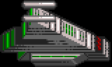
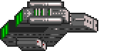

{:.right}

The Rigellians are one of the harder aliens in the game.

1. Table of Contents
{:toc}

### Unique traits

The Rigellians are weak to electricity. Vortex weapons deal 250% of normal
damage when facing the Rigellians. This is true even the player were to fire
Vortex against himself.

They gain 2 population per day, provided that they have a Farm to provide food
and radiation is not 50% or higher. Even at high radiation, their population
will not reduce. They require housing or their colony is immediately destroyed.

Their particular technologies include long-range asteroid sensors, more powerful
nuclear missiles, and a missile and ship hardpoint which halves power
production.

### Buildings

Each alien building has a name, a type (as it counts on a spy satellite report),
Hit Points, build time (in days), a height (for the purpose of scaffold), a
width (1, for one-square, or 4 for a 2x2 building), a softcap (buildings marked
! have a hard cap instead), and the building at the equivalent position in the
Terran building list.

| Name                      | Type    |  HP |  BT | H | W |  Cap | Equivalent
|:--------------------------|:--------|----:|----:|--:|--:|-----:|:-----------------------
| Community                 | General |  16 |  20 | 1 | 1 |    6 | Living Quarters
| Energy Globe              | Power   |  24 |  24 | 1 | 1 |    5 | Power Store
| Storage Racks             | General |  20 |  14 | 1 | 1 |    5 | Storage Facility
| Defence Battery           | Defence |  24 |  40 | 1 | 1 |    4 | Anti-Missile Pod
| Energy Gatherer           | Power   |  16 |  10 | 1 | 1 |    6 | Solar Panel
| Filtration Plant          | General |  24 |  30 | 1 | 1 |    4 | Decontamination Filter
| Weapons Facility          | Offense |  24 |  26 | 2 | 1 |    2 | Weapons Factory
| Extractor                 | General |  16 |  14 | 1 | 1 |    4 | Mine
| Shield Generator          | Defence |  32 |  45 | 1 | 1 |    1!| Screen Generator
| Gravitic Convertor        | Defence |  32 |  42 | 2 | 1 |    1!| Gravity Nullifier
| Extractor                 | General |  24 |  22 | 2 | 1 |    4 | Deep Bore Mine
| Missile Launcher          | Offense |  18 |  28 | 1 | 1 |    4 | Missile Silo
| Probes                    | General |   5 |  26 | 3 | 1 |    2 | Sensor Array
| Turret                    | Offense |  20 |  36 | 1 | 1 |    4 | Plasma Turret
| Deep Space Probes         | Offense |  22 |  35 | 2 | 4 |    1!| ~~Seismic Penetrator~~
| Reactor Core              | Power   |  26 |  40 | 2 | 4 |    2 | Powerplant
| Strategic Bunker          | General |  32 |  45 | 2 | 4 |    1!| Command Centre
| Ground Dock               | Offense |  20 |  35 | 2 | 4 |    2 | Construction Yard
| Turret                    | Offense |  10 |  16 | 1 | 1 |    6 | Laser Turret
| Community                 | General |  24 |  32 | 3 | 1 |    4 | Resiblock
| Science Labs              | General |  20 |  32 | 3 | 1 |    2 | ~~Medical Centre~~
| Farm                      | General |  16 |  24 | 3 | 1 |    4 | Hydroponics

Community
: A two-tier building which can hold up to 100 colonists.
At least one Community of either type must must exist or the colony is
destroyed.

Community
: A four-tier building used to store up to 200 colonists.
At least one Community of either type must must exist or the colony is
destroyed.

Deep Space Probes
: A long-range sensor which triggers every 100 days divided by the number of
colonies. Automatically detects a Terran asteroid, then launches a missile
strike.

Defence Battery
: Anti-missile pod. Has a 21% chance to shoot down incoming missiles. Each
additional battery after the first adds an additional 4% chance, for a maximum
of 71% at 14 pods, although they will only build 4 before hitting a soft cap.

Energy Gatherer
: A power building. At least one power building of any sort is required to power
Gravitic Convertor, Ground Dock, or Extractor.

Energy Globe
: A power building. At least one power building of any sort is required to power
Gravitic Convertor, Ground Dock, or Extractor.

Extractor
: A mine. Mines 1 randomly-chosen ore each day from the first 5 ores.

Extractor
: A deep bore mine. Mines 2 units of a randomly-chosen ore from the last 5 ores.

Farm
: Required for colony life. If there is not at least one farm, the colony loses
two population per day and sets priority every 16 days to build cluster 2
(Strategic Bunker, Community (Small), Farm and Energy Gatherer).

Filtration Plant
: A radiation filter. Reduces radiation by 30%.

Gravitic Convertor
: A gravity nullifier. Requires at least one Reactor Core, Energy Gatherer or
Energy Globe to function. Does not work if the asteroid has a set speed.
May in fact double as an Asteroid Engines.

Ground Dock
: A shipyard. Requires the colony to have at least one power building (Energy
Gatherer, Energy Globe, or Reactor Core); one Weapons Facility; and one
Extractor of either type. A maximum of 4 shipyards can operate at any one
colony, although the soft cap on building is 2.

Missile Launcher
: {:.left}
Required to make or launch missiles.

Probes
: Increases the chances of spotting Terran spy satellites. The base chance is 1%
plus a cumulative 1% per day, and each Probes adds an additional chance
per day.

Reactor Core
: A power building required to build missiles. At least one power building of
any sort is required to power Gravitic Convertor, Ground Dock, or Extractor.

Science Labs
: Unknown.

Shield Generator
: A screen generator with the unique property that it covers every building on
the asteroid.

Storage Racks
: Storage facility. Appears to have no use.

Strategic Bunker
: Required to co-ordinate mining. Number of Extractors is effectively halved
without this building.

Turret
: A laser turret. Deals 5 damage, equal to a Terran plasma turret.
Fires on a 6 day cooldown.

Turret
: A plasma turret. Deals 7 damage, 40% more than a Terran plasma turret.
Fires on a 6 day cooldown. The Rigellians do not use photon turrets at all, and
their photon turret/cannon damage is hardcoded to deal zero damage.

Weapons Facility
: Required to build missiles or ships.

### Building strategy

Every 60 days, a Rigellian colony attempts to build. They require no currency or
ore to do so. When there is no emergency, they randomly build one of the
following sets of buildings:

* 0: Defence Battery, Weapons Facility, Missile Launcher, Energy Gatherer
* 1: Strategic Bunker, Community (Small), Farm, Energy Gatherer
* 2: Gravitic Convertor, Community (Big), Reactor Core, Storage Racks
* 3: Turret (Laser), Turret (Plasma), Energy Gatherer, Energy Globe
* 4: Extractor (Standard), Energy Globe, Science Labs, Community (Big)
* 5: Extractor (Deep Bore), Reactor Core, Ground Dock, Missile Launcher
* 6: Filtration Plant, Probes, Missile Launcher, Farm
* 7: Shield Generator, Energy Gatherer, Deep Space Probes, Storage Racks

Each building will be placed unless it has hit the limit for that building, in
which case there is a 25% chance they will ignore the limit and build anyway.
The Deep Space Probes, Gravitic Convertor, Shield Generator and Strategic Bunker
are hard-capped at 1 per colony.

If there is no power building or Farm on a colony, they will set priority to
build cluster 1 (Strategic Bunker, Community (Small), Farm, Energy Gatherer).

### Missiles

Each asteroid attempts to build a missile every 30 days. They must have a
Reactor Core, Weapons Facility and Missile Launcher to build missiles. They then
roll on the following random table to see which type of missile is built, to a
maximum of 5 of each type. The "Yield" listed is what the missile shows as on a
spy satellite report.

| Missile         | Build | Yield |
|-----------------|-------|-------|
| Explosive       | 30%   | Low   |
| Area Explosive  | 24%   | Med   |
| Scatter         | 15%   | Med   |
| "Nosferatu"     | 10%   | Other |
| "Bioweapon"     | 10%   | Other |
| "Big Nuclear"   | 5%    | High  |
| Mega            | 3%    | High  |
| Virus           | 3%    | Other |

"Nosferatu"
: Drains the target asteroid's power. All power generation is halved for 20-39
days. Replaces the Antivirus slot.

"Big Nuclear"
: A more powerful version of the Nuclear missile. Deals 10 base damage to every
building instead of 7.

"Bioweapon"
: Twenty population are killed instantly. Then, a virus outbreak occurs. The
Kll-Kp-Qua have an almost identical weapon which does not cause an outbreak.
Replaces the Vortex slot.

Trivia:

* They do not build Napalm, Hellfire or Stasis. This is good, because Stasis is
  annoying.
* They do not use Antivirus or Vortex, since those missiles' slots are replaced
  with custom weapons.

### Ships

To make progress on shipbuilding, the Rigellians require at least one Reactor
Core, Energy Gatherer, or Energy Globe. They also require a Weapons Facility.
They require at least one Extractor of either type. Shipbuilding requires at
least one Ground Dock, with progress increasing faster for each additional
Ground Dock, to a maximum of four.

Each ship an Armour value, speed, number of hardpoints (sometimes erroneous),
ID number in the game code, chance to build, build time, and up to six hardpoints. The names here are
arbitrary and do not appear in the code.

Name                 | Armour| S | H | ID | Bld%    | Days     | HP1| HP2| HP3| HP4| HP5| HP6|
---------------------|------:|--:|--:|:---|--------:|---------:|----|----|----|----|----|----|
"Destroyer"          |    20 | 2 | 2 | 3c | 25%     | 25       | 07 | 00 |    |    |    |    |
"Fighter"            |    20 | 2 | 2 | 3d | 25%     | 40       | 11 | 07 |    |    |    |    |
"Heavy Cruiser"      |    40 | 1 | 2 | 3e | &mdash; | &mdash;  | 06 | 05 | 00 | 02 |    |    |
"Scoutship"          |    15 | 2 | 1 | 3f | 10%     | 10       | 05 |    |    |    |    |    |
"Stealth Bomber"     |    60 | 1 | 4 | 40 | 20%     | 60       | 09 | 07 | 01 | 01 |    |    |
"Vampire"            |    50 | 1 | 4 | 41 | 10%     | 80       | 09 | 07 | 05 | 0d |    |    |
"Transporter"        |    30 | 0 | 2 | 42 |  5%     | 70       | 05 | 05 |    |    |    |    |
"Battleship"         |   100 | 0 | 6 | 43 |  7%     | 100      | 07 | 07 | 00 | 01 | 01 | 05 |

Ship $3c "Destroyer"
: {:.left}
: A fast 20 Armour ship with a Plasma Cannon (7 damage) and an Ion Cannon.

Ship $3d "Fighter"
: {:.left}
A fast 20 Armour ship with what appears to be non-functioning hardpoint slot
reserved for Shield x20. Also has a Plasma Cannon (7 damage).

Ship $3e ~~"Heavy Cruiser"~~
: {:.left}
A slower 40 Armour ship with four hardpoints: a Laser Cannon (5 damage), an
Ion Cannon, a Napalm Orb, and what appears to be a non-functional Photon Cannon
that deals zero damage because the Rigellians are hardcoded to have no photon
technology. Never built randomly. It appears to be dummied out, but it still has
a sprite.

Ship $3f "Scoutship"
: {:.left}
A fast 15 Armour scoutship with a Laser Cannon (5 damage).
Each colony sends out a scoutship every 50 days, which is quite slow.

Ship $40 "Stealth Bomber"
: {:.left}
A slower 60 Armour ship with four hardpoints: Warp Generator, Plasma Cannon (7
damage), and two Disruptors. Due to a bug, Warp Generator does nothing but
make vampires sparkle.

Ship $41 "Vampire"
: {:.left}
A slower 50 Armour ship with four hardpoints: Warp Generator, Plasma Cannon (7
damage), Laser Cannon (5 damage) and a unique power drain hardpoint which halves
an enemy colony's power production.

Ship $42 "Transporter"
: {:.left}
A typical slow transporter with 30 Armour and two Laser Cannons.

Ship $43 "Battleship"
: {:.left}
A slow 100 Armour ship with six hardpoints: Two Plasma Cannons (7 damage), two
Disruptors, an Ion Cannon, and a Laser Cannon (5 damage).

### Starting resources

When facing the Rigellians, the player starts with the following resources:

* Cash: 250,000 credits (Default)
* Blueprints: Building Armour, Construction Droids

The alien colony begins with the following building clusters:

* 1: Strategic Bunker, Community (Small), Farm, Energy Gatherer
* 2: Gravitic Convertor, Community (Big), Reactor Core, Storage Racks
* 5: Extractor (Deep Bore), Reactor Core, Ground Dock, Missile Launcher

They start with the following ships:

* $42 "Transporter" x1

### Colonization strategy

The Rigellians attempt to start a new colony every 35 days. If they have a
colony ship, they will send it to colonize the asteroid. The initial colony
takes 80 days to activate, and each new colony takes 40 days to activate.

A new colony places the following buildings to start:

* 1: Strategic Bunker, Community (Small), Farm, Energy Gatherer

### Mining strategy

The Rigellians require at least one Reactor Core, Energy Globe or Energy
Gatherer to mine. Each Extractor (regular type) mines one random unit of one of
the first five ores each day, and each Extractor (deep bore type) mines two
units of one of the randomly chosen of the last five ores each day.

If there is no Strategic Bunker, the effective number of Extractors is reduced
by half, to a minimum of zero.

In addition, perhaps due to an off-by-one error, the Rigellians also mine one of
the first ores and two units of one of the second ores, even if they have no
mines or Strategic Bunker.

### Population

Population increases by 2 per day, as long as the colony has at least one Farm
and radiation is 40% or lower. Radiation higher than this does not decrease
population. The maximum is 100 per short Community and 200 per tall Community.
The colony must have at least one Community of either type or be destroyed.

### Spying

Each colony has a daily chance to spot one Terran spy satellite in orbit and
shoot it down. The chance begins at 1% and increases by 1% per 16 days. Once
they shoot a satellite down, the chance drops to 6%.

The daily chance is increased by 1% per 16 days for each Probes.

### Scouting

Every 50 days, each colony sends a scout ship to explore a random sector of space.

### Tactical

The Rigellians detect Terran missiles at a range of 40 pixels (above average),
and fleets at a range of 30 (slightly below average).

A timer counts every 100 days divided by the number of Rigellian colonies. When
it triggers at a colony with Deep Space Probes, it automatically detects an
alien asteroid and fires 1-2 Nuclear, 1-4 Scatter, and 1-4 power drain missiles
at a random asteroid.

Otherwise, there's a 10 daycolony cycle which checks for asteroid collisions. If
it does, it fires a single Mega missile at the incoming asteroid. If it has no
Mega missiles or Missile Launcher building, and there is no Gravitic Convertor
(Gravity Nullifier) active, then as a last ditch effort they will evacuate the
asteroid on ships.

Otherwise, every day divisible by four (and on every other day at an asteroid if
the missile frequency counter is at least 140 or asteroid byte 91 bit 3 is set),
there is an 80 daycolony counter, which triggers a 30% chance to launch a
missile strike of 1-3 Virus, 1-4 bioweapon (kill 20 colonist and immediate viral
outbreak), and 1-3 unique powerdrain missile.

The other 70% of the time, there is a 12 day cycle with a huge missile strike of
6 Explosive, 4 Area Explosive, 2 Nuclear, 3 Scatter, and 1 Mega. In both cases
the target is chosen at random from our asteroids known to the enemy.

On the three out of days when it's not using missiles or fleets, it appears to
check for a Transporter and build one if it can't find one. There's code which
appears to make an "Alert" voice line here that I've never seen trigger, maybe
some leftover debug code.
