{:.right width="128px" height="122px"}

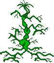{:width="224px" height="262px"}

The Swixarans are the final alien in the game. Defeating this alien, regardless
of if you've completed the other aliens, brings you to the win screen.

1. Table of Contents
{:toc}

### Unique traits

The Swixarans are especially weak to fire-based weapons.

They do not mine. They are quickest to place new buildings, but slow to start
new colonies. They ignore the effects of radiation.

Swixaran population grows at 2 per day as long as there is a Brain, a Stomach,
and enough Tissue Organs to support growth.

Their notable technology is a cloaking device which cloaks their main asteroid.
This takes the form of a large ship similar to the Orbital Space Dock, which is
placed at various colonies.

### Buildings

Each alien building has a name, a type (as it counts on a spy satellite report),
Hit Points, build time (in days), a height (for the purpose of scaffold), a
width (1, for one-square, or 4 for a 2x2 building), a softcap (buildings marked
! have a hard cap instead), and the building at the equivalent position in the
Terran building list.

| Name                      | Type    |  HP |  BT | H | W |  Cap | Equivalent
|:--------------------------|:--------|----:|----:|--:|--:|-----:|:-----------------------
| Tissue Organ              | General |  16 |  20 | 2 | 1 |    8 | Living Quarters
| Power Organ               | Power   |  20 |  14 | 2 | 1 |    5 | Power Store
| Tentacular Defender       | Defence |  24 |  40 | 1 | 1 |    5 | Anti-Missile Pod
| Solar Cells               | Power   |  10 |  10 | 1 | 1 |    8 | Solar Panel
| Classified Division       | Offense |  20 |  16 | 1 | 1 |    3 | Weapons Factory
| Shield Limb               | Defence |  28 |  35 | 2 | 1 |    1!| Screen Generator
| T-Space Generator         | General |  24 |  32 | 1 | 1 |    1!| Gravity Nullifier
| Rocket Portal             | Offense |  16 |  20 | 1 | 1 |    6 | Missile Silo
| Receptor Cells            | General |  10 |  16 | 3 | 1 |    2 | Sensor Array
| Turret                    | Offense |  16 |  20 | 1 | 1 |    6 | Plasma Turret
| Turret                    | Offense |  24 |  28 | 1 | 1 |    6 | Photon Turret
| Tractor Generator         | Defence |  28 |  40 | 3 | 4 |    1!| ~~Seismic Penetrator~~
| Surge Generator           | Power   |  24 |  30 | 1 | 4 |    4 | Powerplant
| Brain                     | General |  80 |  35 | 3 | 4 |    1!| Command Centre
| Docking Portal            | Offense |  24 |  35 | 1 | 4 |    4 | Construction Yard
| Science Brain             | General |  20 |  14 | 1 | 1 |    2 | ~~Medical Centre~~
| Stomach                   | General |  22 |  14 | 1 | 1 |    6 | Hydroponics

Brain
: {:.left} The command centre. If this is destroyed, the colony is destroyed. Due to
order of checks, if there are no Tissue Organs, the colony suffers only the
penalty for having no Tissue Organs, which is -8 colonists per day. With enough
population, the colony can in theory survive long enough to rebuild its Brain.

Classified Division
: 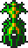{:.left} Weapons Factory. Required to build ships and missiles.

Docking Portal
: {:.left} Shipyard. Requires at least one power building (Surge Generator, Solar Cells,
or Power Organ), and one Classified Division. No ore or currency is required.
A maximum of 4 can operate at one asteroid.

Power Organ
: 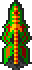{:.left} A power store. Any one of the three power buildings is sufficient to power
certain buildings.

Receptor Cells
: 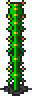{:.left} Increases the chances of spotting Terran spy satellites. The base chance is 1%
plus a cumulative 1% per day, and each Receptor Cells adds an additional chance
per day.

Rocket Portal
: 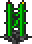{:.left} 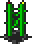{:.left}
Required to build and launch missiles.

Science Brain
: 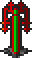{:.left} Unknown.

Shield Limb
: {:.left} A screen generator. From the hard cap of 1 per colony we may assume that it
covers the entire asteroid.

Solar Cells
: {:.left} A power building. Any one of the three power buildings is sufficient to power
certain buildings.

Stomach
: 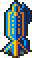{:.left} A food building. The colony loses 2 population per day without one.

Surge Generator
: 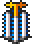{:.left} A powerplant. Specifically required to build missiles.

T-Space Generator
: 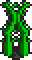{:.left} A Gravity Nullifier. Requires at least one power building.

Tentacular Defender
: 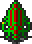{:.left} Anti-missile pod. Has a 21% chance to shoot down incoming missiles. Each
additional one after the first adds an additional 4% chance, for a maximum
of 71% at 14 pods, although they will only build 5 before hitting a soft cap.

Tissue Organ
: {:.left} Provides housing for up to 100 colonists. If there is not at least one of
these, the colony loses 8 population per day.

Tractor Generator
: {:.left}
Aprerequisite to construct the Cloak Generator, a large Orbital Space Dock type
ship. It takes 80 days to build the Cloak Generator.

Turret
: 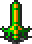{:.left} A plasma turret. Deals 7 damage, 20% more than its Terran equivalent.
Fires on a five-day cooldown, the same as Terran turrets.

Turret
: {:.left} A photon turret. Deals 11 damage, 37.5% more than its Terran equivalent.
Fires on a five-day cooldown, the same as Terran turrets.

### Building strategy

Every 50 days, faster than any other alien, a Swixran asteroid attempts to
build. They do not require currency or other resources to do so. In the absence
of an emergency they attempt to build one of the following sets:

* 0: T-Space Generator, Surge Generator, Tissue Organ, Tractor Generator
* 1: Tissue Organ, Stomach, Solar Cells, Brain
* 2: Tentacular Defender, Turret (Plasma), Rocket Portal, Solar Cells
* 3: Classified Division, Rocket Portal, Power Organ, Turret (Photon)
* 4: Stomach, Tissue Organ, Surge Generator, Shield Limb
* 5: Science Brain, Docking Portal, Solar Cells, Tissue Organ
* 6: Stomach, Receptor Cells, Tissue Organ, Turret (Plasma)
* 7: Tentacular Defender, Turret (Photon), Power Organ, Tissue Organ

Each building has a 100% chance to be built until it hits the maximum for that
building, in which case there is a 25% chance it will ignore the maximum and
build anyway. Exceptions are the Brain, Shield Limb, T-Space Generator and
Tractor Generator, which have a hard cap of 1 per colony.

Every 16 days, if the colony has no Stomach, no power building, or no Tissue
Organ, the colony sets priority to build set 1 (Tissue Organ, Stomach, Solar
Cells and Brain).

### Missiles

Each asteroid attempts to build a missile every 30 days. They require at least
one Surge Generator, Classified Division, and Rocket Portal. They do not require
any currency or ore.

A random missile is built, chosen from the percentile table below, to a maximum
of 5 of that type of missile:

| Missile         | Build | Yield |
|-----------------|-------|-------|
| "Darkness"      |  25%  | Med   |
| Area Explosive  |  24%  | Med   |
| Explosive       |  20%  | Low   |
| "Infestation"   |  11%  | Other |
| Scatter         |  10%  | Med   |
| "Bioweapon"     |  5%   | High  |
| Virus           |  3%   | Other |
| Mega            |  2%   | High  |

"Bioweapon"
: Kills fifty colonists. Replaces the Antivirus slot.

"Darkness"
: Melts all Sensor Arrays on the asteroid. Replaces the Vortex slot.
Specifically fired in response to detecting a spy satellite.

"Infestation"
: An asteroid hit by this weapon takes 10 damage to a random building every 4
days. It triggers 4-9 times. Multiple such missiles can extend the timer, but it
still only triggers once every 4 days. Replaces the Stasis slot.

Trivia:

* They do not use Napalm, Hellfire, or Nuclear. They do not use fire-based
  weapons of any sort except for an unused ship class which uses Napalm Orb.
* They do not use Stasis, Vortex or Antivirus, since those missile slots are
  replaced with custom missiles.
* They are the only alien not to use Nuclear, except for the Tylarans who use no
  missiles.

### Ships

Progress on ships requires at least one power building (Surge Generator, Solar
Cells, or Power Organ). It also requires at least one Classified Division and
one Docking Portal, with each additional Docking Portal increasing build speed
up to a maximum of four.

If a Tractor Generator building exists, it begins construction of a space
station in orbit, which completes in 80 days. This space station doesn't require
any other buildings to begin or continue construction. It serves as a cloak
generator for the Swixaran home asteroid.

Each ship an Armour value, speed, number of hardpoints (sometimes erroneous), ID
number in the game code, chance to build, build time, and up to six hardpoints.
The names here are absolutely made-up and do not appear in the code.

Name                       | Armour| S | H | ID | Bld%    | Days     | HP1| HP2| HP3| HP4| HP5| HP6|
---------------------------|------:|--:|--:|:---|--------:|---------:|----|----|----|----|----|----|
"Destroyer"                |    20 | 2 | 3 | 3c | 28%     | 30       | 06 | 00 | 09 |    |    |    |
"Ghost Pepper"             |    30 | 2 | 3 | 3d | 25%     | 40       | 07 | 0e | 09 |    |    |    |
"Danger Carrot"            |    40 | 1 | 2 | 3e | &mdash; | &mdash;  | 06 | 05 | 00 | 02 |    |    |
"Scoutship"                |    10 | 2 | 1 | 3f | 10%     | 10       | 06 |    |    |    |    |    |
"Do Like Green Jelly"      |    50 | 1 | 4 | 40 | 10%     | 60       | 07 | 07 | 01 | 0e |    |    |
"Danceporter"              |    20 | 1 | 2 | 41 | 15%     | 20       | 07 | 00 |    |    |    |    |
"Red Hot Chili Pepper"     |   100 | 0 | 3 | 42 |  5%     | 90       | 07 | 07 | 0f |    |    |    |
"Fleet Broccoliship"       |    80 | 0 | 6 | 43 |  7%     | 90       | 07 | 07 | 00 | 01 | 01 | 0e |
"Cloak Generator"          |   100 | 0 | 4 | 4b | &mdash; | 80       | 07 | 07 | 07 | 07 |    |    |

Ship $3c "Destroyer"
: 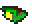{:.left}
A fast 20 Armour ship with three hardpoints: a Photon Cannon (11 damage), Ion
Cannon, and Warp Generator. Due to a bug, the warp generator does not make alien
ships immune to damage, it just makes them harder to see.

Ship $3d "Ghost Pepper"
: 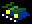{:.left}
A fast 30 Armour ship with three hardpoints: a Plasma Cannon (7 damage), a
Warp Generator, and a unique Swixaran bioweapon which reduces population by 5.

Ship $3e ~~"Danger Carrot"~~
: 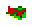{:.left}
A slower 40 Armour ship with four hardpoints: a Photon Cannon (11 damage),
Ion Cannon, and Napalm Orb. Also has a Laser Cannon, which deals 0 damage
because the Swixarans are hardcoded to not use laser. Notable for its
orange spikes. Never built randomly, and appears to be dummied out.

Ship $3f "Scoutship"
: {:.left}
A fast 10 Armour scoutship with a Photon Cannon (11 damage).
Each colony sends out a scoutship every 40 days, which is quite slow.

Ship $40 "Do Like Green Jelly"
: 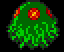{:.left}
A slower 50 Armour ship with two Plasma Cannons (7 damage), a Disruptor, and a
Swixaran bioweapon which reduces population by 5. Looks like a big green
jellyfish.

Ship $41 "Danceporter"
: 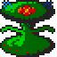{:.left}
A slower 20 Armour ship with a Plasma Cannon (7 damage) and an Ion Cannon.
A Transporter, despite its smaller size and peculiar wiggling arms.

Ship $42 "Red Hot Chili Pepper" 
: 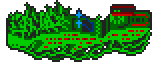{:.left}
A slow 100 Armour ship with two Plasma Cannons (7 damage) and a unique
self-destruct device. The ship overheats its engines and explodes the asteroid
after a countdown. Does not count as a battleship on an Intel report,
as it takes up the Transporter slot.

Ship $43 "Fleet Broccoliship"
: 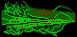{:.left}
A slow 80 Armour battleship with six hardpoints: two Plasma Cannons (7 damage),
two Disruptors, an Ion Cannon, and a Swixaran bioweapon which reduces population
by 5.

Ship $4b "Cloak Generator"
: {:.left}
An Orbital Space Dock type ship which makes the home asteroid invisible.
Cannot be built at the cloaked Swixaran home asteroid. Has 100 Armour and four
Plasma Cannons (7 damage). It takes 80 days to build one.

### Starting resources

When facing the Swixarans, the player starts with the following resources:

* Cash: 250,000 credits (Default)
* Blueprints: Gravity Construction Droids, Plasma Turret, Screen Generator

The alien colony begins with the following clusters:

* 0: T-Space Generator, Surge Generator, Tissue Organ, Tractor Generator
* 1: Tissue Organ, Stomach, Solar Cells, Brain
* 2: Tentacular Defender, Turret (Plasma), Rocket Portal, Solar Cells

Thy start with the following ships:

* $41 "Danceporter" x1
* $3c "Destroyer x5

__In addition__, the Swixarans start with two extra colonies. Each has the
following building clusters:

* 0: T-Space Generator, Surge Generator, Tissue Organ, Tractor Generator
* 1: Tissue Organ, Stomach, Solar Cells, Brain
* 3: Classified Division, Rocket Portal, Power Organ, Turret (Photon)

And each of the two extra colonies has the following ships:

* $4b "Cloak Generator" x1
* $3c "Destroyer" x4

The main colony will be cloaked until the cloak generators are destroyed. The
main colony is frequently located between the two other colonies, and can be
rammed with asteroid engines even if you can't detect it on the map.

### Colonization strategy

The Swixarans uniquely begin with three colonies, one of which is cloaked by
generators installed in orbit around the other two. They main colony activates
80 days after game start, while the other two activate after only 40 days.

The Swixarans start a new colony only every 120 days. They require a
Transporter, which for the Swixarans is a medium-sized ship. If none exists,
they will schedule one for construction. New colonies become active after 40
days.

The transporter carries 50 colonists, but does not actually take any from the
existing asteroid.

A new colony places the following buildings:

* 1: Tissue Organ, Stomach, Solar Cells, Brain

### Mining strategy

The Swixarans do not mine. They have no mining buildings or ore storage
buildings, and have no use for ore.

### Population

Population grows by 2 per day, as long as there is at least one Stomach, Tissue
Organ, and Brain. The maximum population is 100 per Tissue Organ. If there are
no Tissue Organs, population instead decreases by 8 per day. Radiation has no
effect.

The colony needs at least one Brain or is destroyed. However, Tissue Organ takes
precedence, so if there are no Brains or Tissue Organs, the colony loses 8 per
day instead of being destroyed.

### Spying

Each colony has a daily chance to spot one Terran spy satellite in orbit and
shoot it down. The chance begins at 1% and increases by 1% per 16 days. Once
they shoot a satellite down, the chance drops to 6%.

The daily chance is increased by 1% per 16 days for each Receptor Cells.

Additionally, after shooting down a spy satellite, the colony marks the player
for retaliation (see Tactical, below).

### Scouting

Every 40 days, each colony sends a scout ship to explore a random sector of space.

### Tactical

Swixarans have a sensor range of only 30 pixels (below average) for incoming
missiles or spy satellites, and only 20 pixels (the lowest) for incoming ships.
Their sensor technology is poor.

Whenever the Swixarans shoot down a spy satellite, they intentionally target the
most populated known Terran asteroid for retaliation. They fire a missile strike
of 1-4 Explosive, 1-4 infestation weapons (random damage to buildings over
time), 1-4 unique missiles which destroy all Sensor Arrays, and 1-2 bioweapons
(each kills 50 colonists).

If the Swixarans detect an incoming missile or ship, they retaliate, an there is
a 12 day delay before they can begin another retaliation. There is a 30% chance
at this point that the Swixarans will launch a massive missile attack against a
random known colony. It loops 101 times selecting random non-Mega missiles. This
can only include up to 5 of each of 7 types of missiles or 35 maximum, and it's
possible to have less than 35 in total if there are fewer at the asteroid or it
keeps picking missiles that are all out.

If the missile doesn't occur, there's a 10 daycolony cycle with a separate 10%
chance to fire the massive missile strike.

If none of these happen, a new fleet will randomly be made if there are at least
14 ships at the asteroid, and will contain 0-13 ships. The fleet activity has a
a cooldown of 14 days. They intentionally attack the most populated asteroid.
Their fleets will retreat after 70% destroyed. A ghost fleet can be created with
no ships.
