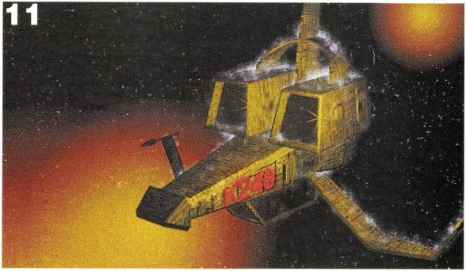

This article chronicles the development and release of _K240_, a 1994 strategy
game published by Gremlin Graphics for the Commodore Amiga.

1. Table of Contents
{:toc}

### Background
#### Origins: K240's predecessor Utopia

K240 is fundamentally a sequel to _Utopia: The Creation of a Nation_, a
planetary colony management sim released around September 1991. We would today
recognize Utopia's genre as a "real-time strategy" (RTS), although it was only
after Utopia's release that the genre was named and defined by _Dune II_ (1992)
and refined by games like _Warcraft: Orcs & Humans_ (1994) and
_Command & Conquer_ (1995).
Amiga magazines instead interpreted _Utopia_ as a god game like _Populous_,
while Utopia's programmer Graeme Ing instead thought of it as a management
strategy simulation like _Sim City_.

The development of _Utopia_ was detailed in a series of articles in
[Games-X](https://segaretro.org/Games-X) magazine. Games-X #1 page 44 describes
how Utopia was originally planned as a fantasy city-building sim titled
_Fantasym_, inspired by _Sim City_ (1989). The game was pitched to publisher
Gremlin in June 1990 as the developers, Graeme Ing and Robert Crack, finished
work on _BSS Jane Seymour_ (also called _Spacewrecked_).

The game setting was soon changed from fantasy to futuristic in order to replace
ground units with spaceships, avoiding the challenge of writing unit
pathfinding code and making unit movement more dynamic (although the final game
would feature ground units with terrain and pathfinding anyway). The game was
given a working title of _World_, and by early August 1990 a roughly 100-page
specification had been written. It was initially designed with a top-down view,
with a custom-made map editor tool, although it would change to isometric view
similar to _Populous_. The game used some code from _BSS Jane Seymour_. In
September 1990, Ing acquired a development PC running SNASM68K, a cross-assembly
system connected to the Amiga via SCSI.

In Games-X #4 pages 40-41, Ing describes the technical challenges of actually
turning his map builder into a working game. The simulation was kept relatively
simple in order to retain sufficient CPU for the sprite engine. Ing advises
developers to add game rules one at a time and test as they go, and to keep
careful notes about game data structures. In November he incorporated Gremlin's
in-house disk routines to make the game bootable without SNASM, and discovered
that this actually made it difficult to copy his own disk, although he was able
to find one disk copying tool which could copy it. (_Utopia_ used NDOS format
disks which could not be copied normally by Workbench; _K240_ would later use
the standard Amiga disk format, allowing for hard disk installs.)

In Games-X #8 page 30 Ing describes that at the start of December 1990 he began
work on the sprite engine, the largest piece of code. The code for actually
drawing the sprites took a full day, while it took longer to write code to
prevent from colliding with terrain or with one another.

[The One Amiga #35](https://archive.org/details/TheOneIssue35Aug91/page/n47/mode/1up)
(August 1991) pages 48-50 went into some detail on the game's development
process. The switch from top-down to isometric created a lot of technical
challenges, such as unit pathfinding and drawing sprites moving behind
buildings. A modified version of the game was used as an isometric map editor.
At time of the article's writing (probably June or July 1991), only the first
scenario was completed, but there were already plans for an expansion disk. The
trading and spying features were yet to be implemented. The article ended with a
brief suggestion that Ing's next game would be an even bigger strategy title.

The Utopia article series was concluded in August 1991 with a preview in
Games-X #15 p.43. It was joined that month by previews in _The One Amiga_ #35
(who complained that it was likely to draw out tired comparisons to _Populous_
and _Sim City_) and _CU Amiga_ (who described it as a cross between _Populous_
and _Sim City_).

_Amiga Format_ #26 in September 1991 noted that the game's tactical control
features were not finished at time of going to press (around August 1991).
_Amiga Power_ #5 interviewed Ing, who described it as inspired by _Sim City_ but
with the addition of an enemy, and with an isometric view in order to appear
more visually impressive.

_CU Amiga_ (Sep 1991) described that it took artist Berni Hill six weeks to create
all of the game's graphics on an Amiga with Deluxe Paint III. Berni described
his hopes of working on a Super Nintendo game next, which he would realize as a
horizon artist in Gremlin's _Top Gear 2_. 

Reviews of Utopia varied. Games-X #17 reviewed _Utopia_ on pages 16-17, rating
it 4.5 out of 5 and announcing the Amiga release for September 1991, with an
Atari ST release in October 1991. CU Amiga rated it 94%, awarding it the coveted
Super Star and describing it as the best game Gremlin has ever released.
However, Stuart Campbell rated it only three stars in _New Computer Express_,
describing it as too easy and the game's goal of increasing a quality of life
statistic to be unsatisfying. Campbell also reviewed it at 81% for
_Amiga Power_ #6, complaining that it lacked depth and direction, and that the
small screen size made it hard to get an overview of the entire colony.

_Utopia_ thus took 15 months from initial conception to release with only a
single programmer, although some game code was re-used from Ing's previous game
and Gremlin libraries.

#### Utopia: The New Worlds

[CU Amiga's review](https://amr.abime.net/review_8966)
of _Utopia_ in September 1991 hinted that a sequel was already in the works,
quoting Graeme Ing as saying "I like my games to get bigger every time".

[An interview](http://amr.abime.net/review_36809) with Graeme Ing appeared in
Amiga Action #28 (Jan 1992). Graeme describes Utopia's main literary influences
as Larry Niven's _Ringworld_ and Joe Haldeman's _The Forever War_, while its
game design was influenced by a desire to expand on the concepts introduced by
_Sim City_. However, he admits that the off-screen final confrontation with the
alien was anticlimactic. Ing predicted that the Amiga had at least five more
years as a viable gaming platform, but that it would move toward big strategy
titles. (An era of landmark strategy titles would indeed take place, but on the
PC, not the Amiga.)

He also announced two follow-ups to _Utopia_: an expansion disk, and a
fully-fledged sequel, _Utopia 2_. Early plans for _Utopia 2_ included more
advanced alien AI, the ability to see the alien city, and the ability to target
individual alien buildings. Gremlin Graphics even offered five signed copies of
_Utopia_ in a contest seeking innovative ideas for the sequel.

At the end of 1991 when the interview took place (magazines usually released
earlier than the month on the cover), Utopia 2 was still in the planning stage,
but its release was scheduled for the end of 1992.

However, according to [a preview](http://amr.abime.net/review_20463) in
The One Amiga #59 (Aug 1993), development on Utopia 2 did not actually
start until May of 1992. This may be due to Graeme first spending four months
of 1992 working on the Utopia expansion disk _Utopia: The New Worlds_, according
to a [review](http://amr.abime.net/review_3994) in the April 1992 issue of CU
Amiga.

The _Utopia_ expansion disk received middling reviews, rated only 72% by CU
Amiga's Tony Dillon, who felt the price of £15 for new levels to an existing
game was too steep. Amiga Power's Stuart Campbell argued that even reviewing a
data disk was irrelevant: such expansions never radically change a game's core
features, meaning that readers do not need any new information to inform their
purchasing decision&mdash;if you liked the original you'll like the expansion,
and if you didn't, you won't.

Among the scenarios in the _Utopia_ data disk was a set of islands requring the
player to build spaceships to cross between them, which would become a core
mechanic of K240.

### Development of K240
#### 1992

Insight into K240's early development comes primarily from four magazine
previews which interviewed Graeme Ing:
[Amiga Action #28](https://amr.abime.net/review_36809) (Jan 1992) pages 60-61,
[The One Amiga #59](http://amr.abime.net/review_20463) (Aug 1993) pages 40-41,
[Amiga Action #48](https://amr.abime.net/review_25444) (Sep 1993) pages 58-49,
and [CU Amiga](http://amr.abime.net/review_29004) (March 1994) pages 62-63.

_The One_ #59 gives a start date of May 1992 for K240's development, originally
given the working title of _Utopia 2_. March 1994's _CU Amiga_ describes it as
being developed "on and off" for nearly two years, which would concur.

Like _Utopia_, development of K240 began by writing a large design document. The
original concept was a military space strategy game which would expand on
_Utopia_. The concept of asteroids was added a few days into the design stage.
Other early ideas included more advanced AI, the ability to see the enemy
settlement directly, and the ability to control your units in a tactical
fashion to target individual key buildings.

However, the original design was massively over-ambitious, and Ing later
admitted that it would have taken over five years to implement all the features
originally planned. Many features were removed or changed from the original plan
during the game's development, in some cases because gameplay issues were found
with game mechanics in developer testing, and in others because they were found
to be technically not feasible, such as null modem multiplayer.

Despite initial claim of a release by the end of 1992, development continued
through the second half of the year and into 1993. An screenshot from an early
stage of development (no later than July 1993) appearing CU Amiga Mar 1994 shows
a test of the dialog box system, an older version of the starfield background, a
familiar asteroid layout, and buildings recognizable as the Protected Solar
Matrix, Solar Generator, Plasma Turret, a Command Centre, an alien Ore Eaters'
Civilian Dome, and scaffolding.

According to [a 2014 interview](https://archive.org/details/RetroGamer_134/page/16/mode/1up?q=k240)
with artist Pete Daniels in RetroGamer issue 134, all of the game's art was
created on an Amiga 500 in Deluxe Paint. He describes K240 as being developed on
an Amiga and taking only six months to develop, although this may be referring
to the graphics only, since the finished game evidently took significantly
longer.

#### 1993

Much of the game's graphics and core features were completed by July 1993.
Screenshots previewed in _The One_ #59 show largely finalized graphics,
including the font, ship building window layout, missile targeting input screen
with accuracy readout and asteroid direction marking, an updated starfield
pattern, Vortex and fire-based weapon effects, and Asteroid Engines.

However, we see older sprites for several ships and buildings, including the
Battleship, Transporter, Transporter wireframe, more colourful palettes on
several Terran ships (a trait mentioned in the game manual), Construction Yard,
Environment Control, and a pagoda-like building sprite which does not appear to
represent any Terran building in the final game.

Buttons have been extracted for the fleet, ship cursor, missile, fleet submenu,
asteroid submenu, building window, and detonate buttons; the PANEL cheat in the
final game would show these plus the contents of the asteroid submenu, financial
button, geological analysis button, and Sci-Tek button, suggesting that perhaps
blueprints were not yet implemented, or at least not being tested.

_The One_ #59 introduces it as an asteroid mining game with military strategy
gameplay, originally intended to be set in the 
[Large Magellanic Cloud](https://en.wikipedia.org/wiki/Large_Magellanic_Cloud),
which we still see referenced on the cover the final game's manual ("Magellanic
Mining Guidelines"). _Amiga Action_ #48, the following month, gives a similar
interview with many of the same screenshots, and we can see some slightly
different ship statistics, including a Transporter which builds in 50 days
instead of 114, Plasma Cannons priced at only 1000 credits, and ships with
impossible configurations (high Armour values not possible in the final game
even with Shield x50). The date format also begins with "Y" rather than "E".

By this point, alien scenarios were still intended to include sub-missions like
destroying shield generators, disabling convoys, locating bases, or finding
before the enemy. None of these special missions would make it into the game
except for the Swixaran cloak generator sub-mission. Ing already lamented at
this point that certain features had to be cut for time or technical
limitations, such as more advanced AI.

Last-minute information in the _The One_ article announced the name: "K240",
although it appears to conflates it with the title of the Utopia 1 expansion,
calling it _K240 - the new worlds_. _Amiga Action_ #48 makes the same mistake,
calling the game _K240: The New World_. The name change to K240 may have been to
differentiate it from Utopia in order to stand as its own, more advanced game.

According to the game's producer, Mark Glossop, the name "K240" was coined when
the team, unable to come up with a good name, looked around the room for ideas
and spotted a VHS tape bearing the text "K 240". At a reasonable estimate, this
may have been a TDK brand 240 minute tape. Several such tapes seen online bear
the number "240" beneath the letter "K". The name was not really intended to
mean anything, although it would eventually come to be the name of the sector
in which the game takes place.

The _Amiga Action_ #48 article gives us a familiar count of 40 buildings (as in
the final game) and 16 weapons (technically 16 hardpoints, half of those being
shields). It describes a count of 7 ship types, one short of the final game. I
suspect the ship missing at this point (Aug 1993) is the Orbital Space Dock, the
name string for which appears much later in the strings list than the rest. The
NASA cheat code string in the CU Amiga demo reads "ENTER SHIP 1-7" rather than
"ENTER SHIP 1-8", so the OSD may well have been added after August 1993.  It's
entirely possible that the space dock was inspired by _Star Trek: Deep Space
Nine_, the first episode of which aired in the UK for the first time on 1 August
1993.

A [preview](http://amr.abime.net/review_19688) in Amiga Power #30 (Oct 1993)
suggests that you would have to invest time and money into research, though in
the final game you just buy them as blueprints. Given that the Sci-Tek button
didn't appear in the earlier screenshots, it's possible that technology was
originally supposed to be researched rather than bought. A release date is given
for "September", presumably meaning September 1993, another release date that
the game would miss.

Despite a release date on December 1993 given in _The One_ #59, the game would
not be released until 1994.

#### 1994

In 1994, we begin to get into what can be determined from file dates in the
run-up to the game's release, as well as some more in-depth previews.

A short [preview](http://amr.abime.net/review_35944) in Amiga Format #56 (Feb
1994) has a screenshot which shows a few things of note. The layout of the
extracted buttons is identical to that of the PANEL cheat, which means asteroid
rotation and blueprint purchases are in the game at this point. The Construction
Yard sprite is similar to the CU Amiga demo rather than the final version. There
are two non-Terran large ships at a Terran colony. We can also see two numbers
in the top-left of the screen, probably some kind of debug information (this
also appears in the 1993 screenshots).

File dates in the retail release show the finishing touches being put on the
game for distribution at this point. In February and March 1994, disks 1 and 2
gain startup-sequence files, and disk 3 gains a hard disk installer (adapted
from the installer for _HeroQuest II: Legacy of Sorasil_ (1994)).

A lot of unique development information is revealed in an in-depth
[preview](http://amr.abime.net/review_29004) in the March 1994 issue of CU
Amiga. Tony Dillon drove to Sheffield to interview Graeme Ing in person,
something CU Amiga often did, alllowing them access to some unique information,
in this including case sprite sheets and the intro graphics.

Something interesting appears in the screenshot of the alien load screen. We see
the Swixaran sprite, but what looks like the Ax'Zilanth homeworld (and some
placeholder text). This makes sense because both of these have the ID number #1,
being stored in `alienp1.mgl` and `planet1.mgl` respectively, despite neither
actually being used for alien #1 in the game.

The CU Amiga preview describes that an entirely new feature was added just
before the interview, though the article doesn't say what it was.

Included with that magazine is the K240 demo, which represents an earlier
version of the game code than the final retail release, and presumably a similar
state to that described in the magazine issue. Given publication deadlines for
the March issue of CU Amiga, the demo was probably completed in January 1994,
February at the latest. We can't tell exact dates from disk analysis as the
filenames are dated 1978, meaning the disk was prepared on an Amiga without 

More analysis of the demo executable needs to be done to determine what features
already existed in that version.

The CU Amiga demo's win screen promises a release in March 1994, which it would
also miss. A possible reason for the delay is that Ing also worked on other
games for Gremlin in 1993 and 1994, including CD development for the CD32 ports
of _Striker_ and _Zool_.

### Publication

On 29 April 1994, Commodore International declared bankruptcy. This did not
prevent the release of K240, but likely discouraged Gremlin Graphics from
releasing further games for the platform.

According to producer Mark Glossop, a random crash bug occurred near the end
of development, which was difficult to trace. The game could not be delayed,
due to marketing and duplicating deadlines. Gremlin worked 12 to 14 hour days
attempting to find and fix the cause of the bug, which involved lead programmer
Graeme Ing producing massive hex dumps and playing the game for hours.

The final retail build of K240, version 1.886, was completed on Friday 20 May
1994 at 13:31.

Due to how close it was to the deadline, Mark Glossop had to personally deliver
the master floppies to the disk duplication company in Burnley or thereabouts
(some 65 miles or so from Sheffield), signing off on the game as bug free. A
run of 30,000 copies was produced. (It is uncertain whether Glossop is referring
to the v1.886 release or the v2.000 release here.)

K240, presumably, was released shortly thereafter.

A copy of the game was quickly acquired by someone credited as "Troops & Troll"
and provided to pirate groups TRSI & Zenith (TRZ), who quickly stripped the
manual copy-protection from the game (a two-byte change) and released a pirate
copy on 26 May 1994. In other words, the game was cracked not within six days
of going on sale, but within six days of the finished build.

A second build of the game, v2.000, was completed on Tuesday, 7 June 1994
at 11:15 am. Lead programmer Graeme Ing recalls that it was produced to fix
bugs. Analysis of the game shows that the only substantive change was to fix
the [fleet bug](../game-mechanics/bugs.html),
a random crash which sometimes occurred when moving fleets.

Patrick Phelan is credited with providing the game's music. However, K240 has no
music. [Leave a reply](https://github.com/tetracorp/k240/issues/5)
if you know the answer to this mystery.

### Reception

Several magazines produced [reviews of K240](http://hol.abime.net/2543/review)
for their May 1994 issue. Almost certainly, these magazines received a review
copy of an earlier build, since magazines generally printed their May issue in
April.

This review build is very close to the v1.886 release, and the review copies
even included the game's manual. However, a clue that this is not the final
release is in the [review](http://amr.abime.net/review_9362) in issue 68 of The
One Amiga, which shows the game's win screen using the Intel screen background.
A likely reason for this is that the Swixaran win screen file, `outro3.mgl`, is
too big for the buffer and can crash the Amiga. The review copy probably
replaced all win screens with the Intel screen as a temporary fix; the final
release actually just uses the normal win screen graphic `outro1.mgl` for a
Swixaran win.

In an odd quirk, the [review](http://amr.abime.net/review_13565) by the
Dutch-language _Amiga Magazine_ #29 (Sept-Oct 1994) uses gameplay screenshots
from the CU Amiga demo, not the final game. The giveaway is the asteroid layout
and the old sprite for the Environment Control (the white building at the
right).

Reviews of K240 in the Amiga press were positive. CU Amiga rated it 91%,
receiving the CU Screen Star award for games recieving 85-92%, though missing
out on the ultimate Super Star award. The One Amiga rated it 90%; Amiga Format
84%; and Amiga Power 83%.

These review scores would later appear in an
[advertisement](https://www.lemonamiga.com/games/advert.php?id=625) for the game
published in various Amiga magazines. Of note in this advertisement are the
outdated screenshots from an earlier pre-release build of the game, which appear
to pre-date the CU Amiga demo. They include an older version of the Sci-Tek
screen with a bright blue background instead of the sophisticated graphics, and
the byte font used in _Utopia_. There are also screens depicting the use of the
PANEL and ICBM cheat codes. It also depicts the final box art; an earlier
advertisement for Gremlin depicted a variant with art of an asteroid colony
floating in space.

K240 was criticized by some reviewers for its complexity and unorthodox user
interface. [It appears](https://www.youtube.com/watch?v=aD6d0cH0nNA&t=14m23s)
that some copies of the game included a flyer advertising a 30-minute tutorial
video for K240, with commentary by Graeme Ing. It cost £4.50 including P&P and
was recorded on C180 VHS tape. It's unknown how many copies were sold, if any,
making this a rare artifact, perhaps a lost one.

Unlike _Utopia_, K240 did not receive an expansion disk, and the finished
release did not include an option to load an optional scenario disk.

### Miscellaneous
#### Sequel: Fragile Allegiance

According to an
[internal memo](https://www.gremlinarchive.com/index.php/2019/08/06/gremlin-product-meeting-memo-april-1995/),
a meeting about K240 was held on 11 April 1995 at 3:30 pm. The
[July 1995 issue](https://archive.org/details/pc_power-issue_019-1995_07/page/n34/mode/1up)
of PC Power magazine announced that Gremlin was working on a PC remake of K240.
The game's final title of _Fragile Allegiance_ had evidently not been coined yet,
but would begin to appear in the gaming press following the 1996
European Computer Trade Show (ECTS) held on 14–16 April 1996.

 Promotional render for the K240 PC port in PC Power, July 1995.
{:.center}

This game was written by a completely different team of designers and
programmers, but keeps most of K240's basic mechanics and even maintains
continuity with its lore. For example,
[the intro video](https://www.youtube.com/watch?v=7ZCJ_16r8Sc)
cites Tetracorp's founding in the year 2221, consistent with
[the K240 manual](https://www.lemonamiga.com/games/docs.php?id=904),
which cites this as the year Tetracorp was founded to manufacture scoutships and
sensors for the Imperial Fleet.

_Fragile Allegiance_ was released for MS-DOS and Windows 95 in December 1996.
Development of _Fragile Allegiance_ may have taken up to two and a half years,
assuming it began as soon as the Amiga version of _K240_ was finished.

#### Gremlin Interactive

Graeme Ing, sole programmer on _K240_, went on to work on a number of other
titles, including _Newman/Haas IndyCar featuring Nigel Mansell_ for Sega Mega
Drive, _Shadow Fighter_ (1995),_Normality_ (1996), _EverQuest_ (1999),
_Everquest II_ (2004), and the _Star Wars: Galaxies_ series.

Pete Daniels, K240's artist and co-designer, went on to work on games including
_World Championship Snooker 2004_ (2004), _Kinect Sports: Rivals_, and _Sea of
Thieves_ (2018). In a 2014 interview with RetroGamer magazine, he spoke highly
of K240 and expressed a wish to work a sequel with Graeme Ing one day.

Gremlin Interactive retained numerous floppy disks and backup CDs, although
whether any of those still exist, who might have them, and whether any of
them contain K240 data, is a mystery.

### Detailed timeline
#### 1991

- __20 Sep 1991__: File dates for the game's voice clips and screen background
  art. All have file dates around 9am and within 8 minutes of each other,
  suggesting they were copied to floppy disk from an existing source.
  Based on interviews, this date seems unlikely to be accurate, and may be a
  false date from an Amiga with a hard disk installed in 1991, but no real-time
  clock, such as an A500.

#### 1992

- __Jan 1992__: Amiga Action #28 publishes an in-depth early preview of K240.
- __2 Sep 1992__: File dates for three rendered outro graphics displayed at the
  end of a scenario. Also the date of the disk icon. It's possible that this is
  the default date of an Amiga with a hard disk.

#### 1993

- __Aug 1993__: The One Amiga #59 publishes an in-depth preview of K240.
- __Sep 1993__: Amiga Action #48 publishes an in-depth preview of K240.
- __Oct 1993__: Amiga Power #30 publishes an in-depth preview of K240.
  Amiga Joker also publishes a preview.

#### 1994

- __Jan 1994__: Amiga Dream #3 publishes a preview of K240.
- __Feb 1994__: Amiga Format #56, Amiga Concept #1, and Amiga Joker publish
  previews of K240.
- __18 Feb 1994__: K240 icon file written.
- __28 Feb 1994__: Disk 1 startup-sequence written.
- __Mar 1994__: CU Amiga's March 1994 issue, though probably published in
  February. It includes Coverdisk #77, an exclusive playable demo of K240. The
  win screen gives its release date as March 1994, though the game would not be
  released until at least late May. CU Amiga publishes a preview article.
- __2 Mar 1994__: Installer added to disk 3. Scenario folder created/modified,
  probably to put scenario files in. Game seems to be nearing completion.
- __4 Mar 1994__: Disk 2 startup-sequence written.
- __Apr 1994__: Amiga Computing #74 publishes an in-depth preview.
- __6 Apr 1994__: _Amiga Down Under_ #9 coverdisk of K240 created at 12:38:42.
  It is effectively identical to the earlier CU Amiga coverdisk.
- __29 Apr 1994__: Final game launch icon added. Coincidentally, Commodore
  International declares bankruptcy.
- __May 1994__: Several Amiga magazines
  [review K240](http://hol.abime.net/2543/review). This appears to be an early
  review copy, newer than the CU demo based on the final design for Construction
  Yard, but it uses the Intel background for the Swixaran win screen.
- __16 May 1994__: A Monday. Directory `s` for startup-sequence written.
  Checksum program v1.0 written, according to internal version number.
  However, this program may have been updated on 20th May, as it contains
  a correct checksum for the main game EXE.
- __20 May 1994__: A Friday. Final release build of K240 v1.886 main game
  executable, according to version string.
- __26 May 1994__: Pirate release completed by TRSI and Zenith.
- __7 Jun 1994__: K240 build v2.000 completed at 11:15, according to internal
  version number. Updated checksum program v.2.000 completed, and written to
  disk 3 at 16:33.

#### 1995 onward

- __11 April 1995__: According to an
[internal memo](https://www.gremlinarchive.com/index.php/2019/08/06/gremlin-product-meeting-memo-april-1995/),
a meeting about K240 was held at 3:30 pm, to discuss the PC sequel. PC Power
magazine subsequently posts an announcement.
- __Dec 1996__: PC sequel Fragile Allegiance released.
- __3 Sep 1997__: Someone creates a zip file of K240 which would later be
  uploaded to Gremlin Graphics World as an authorized download.
- __30 July 2001__: Last modified date on the authorized download of K240
  available from Gremlin Graphics World.
- __14 Oct 2001__: Someone makes a slightly modified copy of the TRZ cracked release of
  disk 1. It removes the TRZ cracktro.
