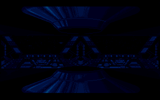
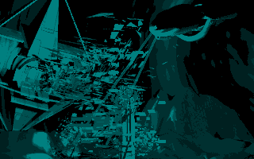
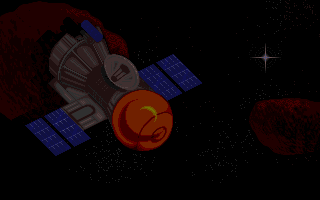
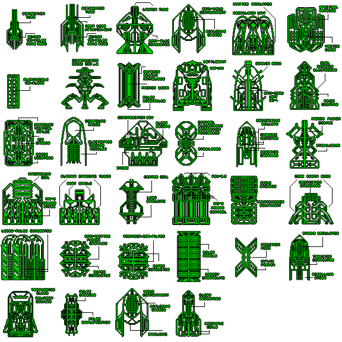
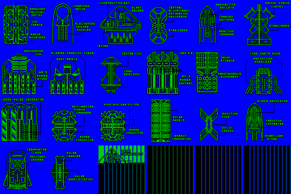
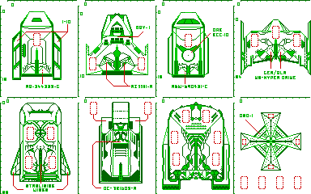

The following images are extracted from all compressed .MGL files on the disk
which contain image data. All are either IFF ILBM format full-screen images at
320 x 200 pixels, or Amiga sprite data. They have been converted to PNG or GIF
for display here. The original IFF versions of the IFF files can be found in the
[images_iff](https://github.com/tetracorp/k240/tree/main/data/images_iff)
directory.

The only MGL files not included here are english.mgl, french.mgl, and
german.mgl, which contain arrays of the translated game text and are extracted
in the [data directory](https://github.com/tetracorp/k240/tree/main/data); and
the [speech](https://github.com/tetracorp/k240/tree/main/data/speech) directory,
which contains voice audio.

### alienp1.mgl

Alien 6 (Swixaran) race picture used on alien select screen. Note how the race
picture numbers do not match up with the usual numbering for the aliens. The
planet image numbers also do not match up.

### alienp2.mgl

Alien 3 (Ax'Zilanth) race picture used on alien select screen.

### alienp3.mgl

Alien 2 (Ore Eater) race picture used on alien select screen.

### alienp4.mgl

Alien 5 (Rigellian) race picture used on alien select screen.

### alienp5.mgl

Alien 1 (Kll-Kp-Qua) race picture used on alien select screen.

### alienp6.mgl

Alien 4 (Tylaran) race picture used on alien select screen.

### demo.mgl

Intro screen exclusive to the CU Amiga K240 demo.

### demo2.mgl

Outro screen exclusive to the CU Amiga K240 demo. Contrary to the date of March
1994 given here, it was not finished until May 1994. £29.99 in 1994 would be
[equivalent to](https://www.in2013dollars.com/uk/inflation/1994?amount=29.99)
£63.56 (US$78.27, or €74.33) in 2022.

### hologram.mgl

Background to the alien select screen. The filename implies that the alien
planet visible in the background is being projected as a hologram.

### lang.mgl

Language select screen: English, Francais, Deutsche. These should properly be
spelled Français and Deutsch.

### outro1.mgl

Win screen. Graphic displayed when the player defeats an alien. The playtest
copy sent to The One Amiga (circa March 1994) uses `satpic.mgl` for the win
screen instead, suggesting that these rendered outro screens were not completed
until the last minute.

### outro2.mgl

Lose screen. Graphic displayed when the player is defeated.
The object on the left is an Orbital Space Dock.

### outro3.mgl

Unused win screen. Graphic intended to be displayed when the player defeats the
Swixarans and therefore beats the game. However, the standard win screen is used
instead. Analysis of the game code reveals a third win screen filename string
which only triggers upon defeating the Swixarans and was no doubt intended to be
`outro3.mgl`, but it just contains `outro1.mgl` instead.

There are two theories as to why. One is lack of time: the outro graphics appear
to have been completed at the last minute, and the final build of the game may
have been completed before the outro was ready.  Another possibility is
technical issues: the memory buffer used to unpack MGL files is only 28,064
bytes, and `outro3.mgl`, at 31,118 bytes compressed, may overrun that buffer.

### planet1.mgl

Planet graphic for alien 3 (Ax'Zilanths).

### planet2.mgl

Planet graphic for alien 6 (Swixaran).

### planet3.mgl

Planet graphic for alien 1 (Kll-Kp-Qua).

### planet4.mgl

Planet graphic for alien 5 (Rigellian).

### planet5.mgl

Planet graphic for alien 2 (Ore Eaters).

### planet6.mgl

Planet graphic for alien 4 (Tylarans).

### satpic.mgl

Background image to the Intel screen.

### scitek.mgl

Background image to the Sci-Tek blueprint purchase screen.

### scitek.mgl (demo)

Background image to the Sci-Tek screen. This variant, used in the CU Amiga demo,
is slightly brighter. The final version was likely reduced in brightness to
improve readability.

### shop1.mgl - shop6.mgl

A combined image showing shop1.mgl, shop2.mgl, shop3.mgl, shop4.mgl, shop5.mgl,
and shop6.mgl, which contain sprite data. They display blueprints as shown on
the Sci-Tek purchase screen. The load times seen while browsing the blueprints
screen are due to loading the next of the six files. Each row of six blueprints
here is one of the files.

Notable: The appearance of the Static Inducer and Warp Generator are reversed
from the ship hardpoint view. The Seismic Penetrator blueprint matches its early
prototype sprite, not the final sprite (see CU Amiga demo).

### shop3.mgl - shop6.mgl (old versions)

A slightly different version of the shop files on the disk of the CU Amiga K240
demo, read from the disk using DiskSalv. They are likely from an earlier build
of the game. The corruption on the bottom-right is due to missing data. The only
notable difference here is that some of the images are moved around a few pixels
from their final position. Additionally, though it is not visible in this image,
the sprites use different palette numbers.

### tetra.mgl

Background to the new game screen.

### wireplan.mgl

Wireframes for the eight ships as displayed on the Construction Yard or Orbital
Space Dock build screen. Sprite data. Wireframes are the same in the CU Amiga
K240 demo.

## Notes

IFF files were converted to PNG/GIF using Imagemagick. The sprite images were
converted using the following script:

    convert planet1.png -crop 64x53 +repage planet1-%03d.png
    convert -delay 13 -loop 0 -dispose 2 planet1-0*.png planet1.gif
    rm planet1-0*.png

Wireframe graphics were extracted using
[Maptapper](https://codetapper.com/amiga/maptapper/), an Amiga sprite extractor
tool. For other sprites in the game, see the Data section on the main page.

MGL files were extracted using
[Denormalize](https://radishengine.github.io/denormalize/), a web-based
extractor for a later Gremlin Interactive game, using the following kludgy
method:

1. With the Inspector open, upload an MGL file.
2. Right-click the "Blob" which appears in the Inspector and store it as a
   global variable
3. Add a download instruction; e.g. temp1.download("scitek.mgl").

At current, I do not know of any method to re-pack an MGL file, although such a
thing would be interesting for the purpose of modding the game.
