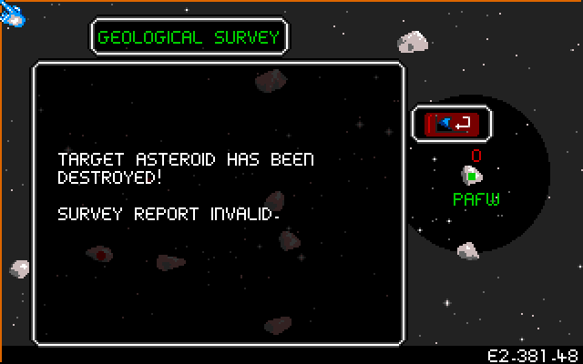

Here are some unusual happenings in the game.

1. Table of Contents
{:toc}

### Surveying a destroyed asteroid

Ore surveys aren't reported in until the Scoutship returns to the asteroid it
set out from. (You can save time by sending the Scoutship to the asteroid, then
conducting the survey, so that it "returns" to the asteroid it just surveyed and
reports instantly.)

But what happens if a surveyed asteroid is destroyed before the Scoutship can
get back with its report?

{:.center}

There's actually a special dialog box for this eventuality, saying "Target
asteroid has been destroyed! Survey report invalid."

This doesn't occur with sector exploration, since those reports are called in
immediately.

### How high can the date go?

The game begins at date E2.380.01. The last section of the date is the day,
which increments about once every 2 seconds real-time. The day goes up to 99, at
which point the day loops back to 01 and the year increments. Notably, there is
no day 00.

But how high can the year go, and how long will it take to get there?

After 619 metric years and 98 days game time, you will reach the date E2.999.99.
It will take 32 hours, 5 minutes, and 58 seconds of uninterrupted play to reach
that time, not counting additional time spent in dialog boxes. You can't leave
the game unattended for this time, because you're constantly interrupted by
dialog boxes for things like [random events](../game-mechanics/random-events.html)
and the Imperial Transporter notification.

However, that's as high as the date goes. After one more day, E2.999.99 loops
around to E2.000.01. They never coded E2 to increment, presumably because it was
considered that nobody would actually play a single round for that long. You
would also probably accumulate enough background radiation increases from Solar
Flare random events to cause a real problem.

### Rare asteroids

There are 24 asteroid layouts, but they appear to always be chosen in order, and
the game never begins with more than 16 or so asteroids. This means there are
some asteroid layouts that you will rarely see because they require a large
number of asteroids to appear before the game will generate them.

 
Asteroid #17, with a hole.
{:.center width="640" height="400"}

 
{:.center width="640" height="400"}

 
Asteroid #19. An asteroid with two sections.
{:.center width="640" height="400"}

 
The asteroid used in the CU Amiga K240 demo.
{:.center width="640" height="400"}

 
{:.center width="640" height="400"}

 
Asteroid 20. Asteroid that looks like a ship.
{:.center width="640" height="400"}

 
Square shaped.
{:.center width="640" height="400"}

 
Asteroid 22. Large asteroid.
{:.center width="640" height="400"}

 
Asteroid 23. Huge asteroid. This is the last in the list and will almost never
be seen, since you need all 24 asteroids to appear at once.
{:.center width="640" height="400"}

The largest asteroids have a rare large asteroid sprite on the space view.
