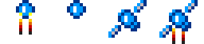
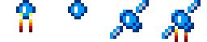
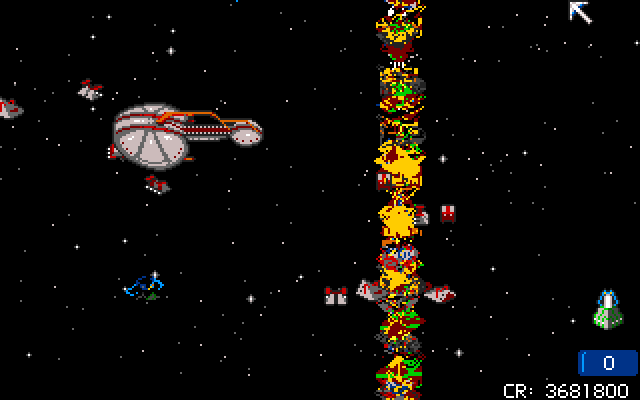

{:.right}

The March 1994 issue of CU Amiga Magazine came with coverdisk 77, an exclusive
demo version of K240. It provides an insight into the state of development of
the game as it neared completion, and has some interesting quirks.

This article briefly describes the demo's release and goes into detail on how it
differs from the finished release.

1. Table of Contents
{:toc}

### History

 Actually delayed until May 1994.
{:.right}

Amiga magazines were generally written around two months in advance of the cover
date. For example, mailing list archives indicate that the May 2000 issue of
Amiga Format, its final issue, already hit the newsstands by 6 April, and the
page layout and editing were already completed by 21 March.

The CU Amiga exclusive K240 demo, distributed with the March 1994 issue, must
therefore have been completed in January 1994, around five months before the
first completed retail build.

The CU Amiga demo isn't all that exclusive. The same demo was given away with
_Amiga Down Under_ #9 (May 1994), and was functionally identical (including the
CU Amiga branding on the title screen) except for some changed file dates. Up to
300 copies of a demo were offered by French magazine _Amiga Dream_ (May 1994),
although it's unknown if this was the same demo or a later French version.

### Building sprites

A number of game sprites reflect earlier versions than the finished release.

| Building | Demo sprite | Full game |
|----------|:-----------:|:---------:|
| Construction Yard      |  |  |
| Environment Control    |  | |
| Protected Env. Control |  | |
| Seismic Penetrator     |  | |

{:.right}

The Seismic Penetrator cannot be acquired in the demo, but the building is still
in the game. The sprite is very different, and more closely resembles the
Seismic Penetrator's blueprint wireframe.

### Satellite sprites

| Demo | Full game |
|------|-----------|
|  |  |

An almost imperceptible change is made to the four frames of the satellite
launch animation. The full game removes a single grey pixel from the bottom of
the thruster in the first and last frames. The middle two frames have their
frame heights slightly adjusted to match adjacent frames, but the actual pixels
are unchanged. (The images here have been scaled up 4x to show detail, but it's
still nearly impossible to see the difference.)

The intel alert icons do not appear in the demo files. These are the text
"LAUNCH", the circled ship icon, and the circled missile icon, used when
a satellite detects fleet deployment or missile launch. This is consistent with
other evidence which suggests that spy satellite features were added late in
development.

An almost unnoticeable detail which appears in both versions is the use of the
blinking color in the first frame. It's hard to see in the game because it only
appears for a split second and it's moving fast when it does.

Of note, the satellite launch sound effect appears to be missing.

### Font changes

| Demo | Full game |
|------|-----------|
|  |  |

The font at this point is missing the foreign language characters "ÇÜÄÖ"
necessary for the French and German translations, respectively. The lowercase
"yzmh" in their place may suggest that there were plans to include these
characters. The French and German translations were added late in development,
and the playtest copies available to French magazine reviewers in March 1994
still lacked French support.

### Other sprites

All other sprites are the same as those in the final game. This includes the
ship sprites, mouse pointers, window frames, fleet icons, and the alien building
and ship sprites (which represent the Kll-Kp-Qua). Even the sprite for the
unused Terran ship called the Orbital Shuttle is there.

Sprites for the different alien ships and buildings are of course absent, since
the demo lacks the external alien data files.

### Sci-Tek background

| Demo | Full game |
|------|-----------|
|  |  |

The Sci-Tek screen in the demo uses a brighter palette. It was probably changed
for the final release to aid readability.

### Changed or missing text strings

Changes to text between the demo and the final release include:

- Text strings relating to intel features, manual protection codes, save game,
  and speech are not yet available.
- The abbreviation for credits is CR, rather than CD.
- The Power Amplifier blueprint was referred to in several places as Power
  Doubler.
- Various game strings are changed to note certain functions missing in the demo
  version. 
- Some strings are still held as hardcoded variables, rather than in a
  variable-offset list which would allow the game to be localized more easily.
  The demo seems to have been built at a point where the conversion to the
  localizable list format wast almost complete, but not quite finished.

You can find a full list of text strings in the file
[gamestrings-demo.txt](https://github.com/tetracorp/k240/tree/main/data/gamestrings-demo.txt).
Most are the same as the final English release and in the same location.

A full detailed breakdown of differences appears in a separate article:
[CU Amiga demo text string analysis](../prototypes/cu-amiga-strings-analysis.html).

### Cheat codes disabled

Cheat codes have been disabled in the demo, although there is evidence that they
did exist at this point in development and were merely stripped from the demo:

- Cheats are referenced in three text strings: `ENTER HELP CODE:`, `ENTER SHIP
  1-7:` (suggesting the `NASA` cheat) and `ENTER SFX A-Z:` (suggesting the sound
  test cheat). The keycode lists are not in the demo, suggesting perhaps that
  the cheat codes themselves were debug-build only and not included in the demo.
- The byte sequence
  `0009 0006 0027 001D 001C 0025 0007 0010 002B 0014 0005 0011 0023 0024`
  appears in the demo. This is the list of extracted buttons for the `PANEL`
  cheat found in the full game. This also tells us that the PANEL layout was
  complete by this point.
- There is a conspicuous gap in the code where the key scancodes for the cheat
  codes are normally located, including a 168-byte run of zeroes which would be
  consistent with 14 bytes for each of 12 cheat codes. This may suggest that all
  twelve cheat codes were present at this point, and similarity might be noted
  with the manual protection codes which also use 14-byte rows of Amiga key
  scancodes. The actual array of cheat codes in the final version is 139 bytes.

However, code for at least several cheats is observed to be missing in the demo.
There is no check for the `SKYSCRAPER` instant building flag, no code which adds
50 population as per `LEMINGS`, no code which inverts the blueprint list as
`WIDGET`, no code which adds 100,000 credits as `LOADSADOSH`, and none which
adds missiles as `ICBM`. The key scancode sequences for these cheats are also
missing.

### Missiles

Explosive missiles strike only a single square. In the final game they strike
four.

Stasis and Mega missile have no effect. Although the code is missing, there are
references elsewhere in the code, such as the Ore Eaters exploding abandoned
asteroid flag which calls Mega. This suggests they may have been edited out. You
can't normally acquire these missiles in the demo, since you don't start with
any.

You also don't start with Nuclear or Anti-Virus, although the code for these
works normally if you cheat one in.

### Missing features

Several major gameplay options are missing from the demo. Some of these are
intentional limitations, but many reflect the unfinished state of the
game at this point. (Aspiring game developers should remember Hofstadter's Law:
It always takes longer than you expect, even when you take into account
Hofstadter's Law.)

Missing features include demolishing buildings, intercepting fleets, building
missiles, building ships, building an Orbital Space Dock, building or launching
satellites, Intelligence reports, establishing new colonies, loading ore onto a
Transporter, selling ore to the Imperial Transporter, buying blueprints, gaining
money based on colonist count, loading and saving the game.

Only one alien is available. The voice sounds and intro are not available,
although this should be obvious given that the demo fits on a single disk
instead of three. Voice-specific code is missing from the game entirely. There
are no strings for French or German translations.

### Buildings

The CPU's output does not deplete over time.

Anti-Missile Pods have a higher chance to shoot down missiles. In the final game
it's 21% for the first Pod and +2% for each additional Pod (or +4% for Terran
missiles, i.e. firing missiles at yourself or at an alien with Anti-Missile
tech). In the demo, it's 31% for the first Pod and +4% for each additional Pod
(+8% for Terran missiles). The final game caps out at 70%, while in the demo
it's 80%. It's a moot point, since neither you nor the enemy can build them.

The code for missile, satellite, ship, and space dock construction are missing
entirely.

Naturally, since you can't purchase blueprints, there are several buildings that
you can't build. However, some of them would still work if you cheated them in.
The Seismic Penetrator still works, although you can't build one in the demo and
your asteroid never starts with any Traxium or Nexos. Gravity Nullifier and
Asteroid Engines will still consume power, and shut down in a power shortage.

### Random events

The Comet, More Ore, and Reinforcements random events have the standard chance,
instead of double chance as in the final game.

The Gravitation Vortex event is removed. The text for the event still appears in
the game strings. This may be because you can't build Asteroid Engines or
Gravity Nullifier, so you have no way of handling this event. The dummy entry
for the event still appears, but it does nothing.

The Ore Bribe event and Fixed Ore Price event are removed the same way. This is
likely because you can't sell ore in the demo.

### Aliens

A lot of code for alien-specific abilities is missing. This includes the
Swixaran vulnerability to fire, the Swixaran cloaking device, the Rigellian and
Swixaran unique ship hardpoints, the Rigellian more powerful Nuclear, the
Rigellian asteroid-wide Shield Generator, and the Ax'Zilanth carefully measured
missile response. Swixaran and Rigellian building name strings are also missing.

There are some instances where alien-specific code seems to have been
intentionally cut or commented out for the demo. For example, in the code which
handles alien asteroids leaving the edge of the screen, there is a specific
check for the Ax'Zilanth Mass Displacement Podule, so that the asteroid can
teleport to save itself. However, the line which calls the teleport is
conspicuously missing from the demo.

Several jump tables for alien-specific code list five aliens, not six. The order
of the Swixarans and Rigellians are reversed in the list, also. Many jump tables
also link to the same code for all aliens; e.g. only the shipbuilding code for
the first alien is there, and all five listed aliens are coded to use the same
one. The code for the other aliens' versions is missing.

The alien Vortex Mine has a 20% hit chance, same as the Terran version. In the
full version, it's 10%.

The Ax'Zilanth Static Inducer missile has no effect. Most unique alien missiles
have no effect.

Aliens never colonize new asteroids.

### Other gameplay differences

You receive a notification when an enemy ship enters sensor range. The full game
has a voice clip for this (`enemyves.mgl` or "enemy vessel detected"), but it's
unused. This is probably because you can't intercept individual ships, and
they're always Scoutships or Transporters that never attack your asteroid
intentionally.

You start with an established colony on a large asteroid. You have the Missile
Guidance System blueprint, and while you cannot build missiles, you have 20 each
Explosive, Area Explosive, Napalm, Hellfire, Scatter, and Vortex, and 10 Virus
missiles. You start with a large amount of money, some of which has already been
distributed into Construction and Intelligence, although Construction is the
only thing you can spend money on in the demo.

However, you can't gain money by any means. You can't sell ore, don't receive
income from colonists, don't get bounties for discovering asteroids or
destroying large ships or alien colonies, and the ore bribe event has been
removed.

You can see the enemy asteroid surface without a spy satellite. This may be
because the Intel system was added late in development.

### Bugs

You can select an alien asteroid and fire their missiles. Another missile bug
lets you re-open the missile window while they're firing and increase the number
of missiles above 20.

Darkened window backgrounds disappear before the window does.

Some alien ship graphics glitch out. Pictured below, the blue shape in the
bottom left quadrant is one glitched ship, and the bright vertical line on the
right is another.

 Graphical glitches.
{:.center}

### Asteroid maps

Asteroid map 0, the player's first colony, is a different shape entirely, based
on asteroid map 15. Asteroid map 1, the alien's first colony, is the map used as
the player colony in the final game, with slight changes.

Asteroid maps 9 and 12 are slightly different.

### Technical differences

Ships take up 52 bytes each instead of 54. The buffer can store 750 ships
instead of 700 as in the final game.

Asteroids take up 740 bytes instead of 750.
