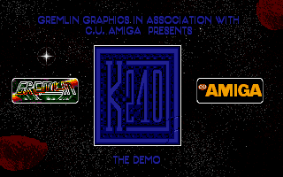
{:.right}

The March 1994 issue of CU Amiga Magazine came with coverdisk 77, an exclusive
demo version of K240. It provides an insight into the state of development of
the game as it neared completion, and has some interesting quirks.

This page is work-in-progress. A full analysis of the K240 demo executable has
yet to be made.

1. Table of Contents
{:toc}

### History

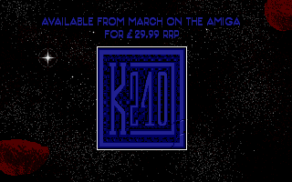 Actually delayed until May 1994.
{:.right}

Amiga magazines were generally written around two months in advance of the cover
date. For example, mailing list archives indicate that the May 2000 issue of
Amiga Format, its final issue, already hit the newsstands by 6 April, and the
page layout and editing were already completed by 21 March.

The CU Amiga exclusive K240 demo, distributed with the March 1994 issue, must
therefore have been completed in January 1994, around five months before the
first completed retail build.

The CU Amiga demo isn't all that exclusive. The same demo was given away with
_Amiga Down Under_ #9 (May 1994), and was functionally identical (including the
CU Amiga branding on the title screen) except for some changed file dates. Up to
300 copies of a demo were offered by French magazine _Amiga Dream_ (May 1994),
although it's unknown if this was the same demo or a later French version.

### Building sprites

A number of game sprites reflect earlier versions than the finished release.

| Building | Demo sprite | Full game |
|----------|:-----------:|:---------:|
| Construction Yard      | 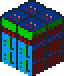 |  |
| Environment Control    | 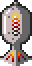 |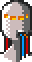 |
| Protected Env. Control | 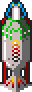 |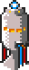 |
| Seismic Penetrator     | 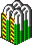 |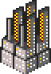 |

{:.right}

The Seismic Penetrator cannot be acquired in the demo, but the building is still
in the game. The sprite is very different, and more closely resembles the
Seismic Penetrator's blueprint wireframe.

### Satellite sprites

| Demo | Full game |
|------|-----------|
|  |  |

An almost imperceptible change is made to the four frames of the satellite
launch animation. The full game removes a single grey pixel from the bottom of
the thruster in the first and last frames. The middle two frames have their
frame heights slightly adjusted to match adjacent frames, but the actual pixels
are unchanged. (The images here have been scaled up 4x to show detail, but it's
still nearly impossible to see the difference.)

The intel alert icons do not appear in the demo files. These are the text
"LAUNCH", the circled ship icon, and the circled missile icon, used when
a satellite detects fleet deployment or missile launch. This is consistent with
other evidence which suggests that spy satellite features were added late in
development.

An almost unnoticeable detail which appears in both versions is the use of the
blinking color in the first frame. It's hard to see in the game because it only
appears for a split second and it's moving fast when it does.

### Font changes

| Demo | Full game |
|------|-----------|
| 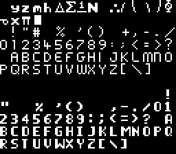 |  |

The font at this point is missing the foreign language characters "ÇÜÄÖ"
necessary for the French and German translations, respectively. The lowercase
"yzmh" in their place may suggest that there were plans to include these
characters. The French and German translations were added late in development,
and the playtest copies available to French magazine reviewers in March 1994
still lacked French support.

### Other sprites

All other sprites are the same as those in the final game. This includes the
ship sprites, mouse pointers, window frames, fleet icons, and the alien building
and ship sprites (which represent the Kll-Kp-Qua). Even the sprite for the
unused Terran ship called the Orbital Shuttle is there.

### Sci-Tek background

| Demo | Full game |
|------|-----------|
| 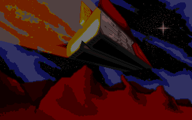 | 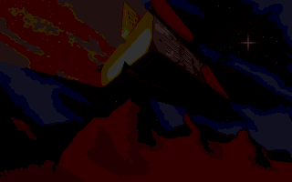 |

The Sci-Tek screen in the demo uses a brighter palette. It was probably changed
for the final release to aid readability.

### Changed or missing text strings

Changes to text between the demo and the final release include:

* Text strings relating to intel features, manual protection codes, save game,
  and speech are not yet available.
* The abbreviation for credits is CR, rather than CD.
* The Power Amplifier blueprint was called Power Doubler.
* Various game strings are changed to note certain functions missing in the demo
  version. 

You can find a full list of text strings in the file
[gamestrings-demo.txt](https://github.com/tetracorp/k240/tree/main/data/gamestrings-demo.txt).
Most are the same as the final English release and in the same location.

A full detailed breakdown of differences appears in a separate article:
[CU Amiga demo text string analysis](2022-05-25-cu-amiga-strings-analysis.html).

### Missing features

Several major gameplay options are missing from the demo. Some of these are
intentional limitations, but many probably reflect the unfinished state of the
game at this point. (Aspiring game developers should remember Hofstadter's Law:
It always takes longer than you expect, even when you take into account
Hofstadter's Law.)

Missing features include demolishing buildings, intercepting fleets, building
missiles, building ships, building an Orbital Space Dock, building or launching
satellites, Intelligence reports, establishing new colonies, loading or onto a
Transporter, selling ore to the Imperial Transporter, buying blueprints, gaining
money based on colonist count, loading and saving the game.

Only one alien is available. The voice sounds and intro are not available,
although this should be obvious given that the demo fits on a single disk
instead of three.

Cheat codes have been disabled, although game strings show that they were in the
game at this point, known as "help codes".

### Gameplay differences

You receive a notification when an enemy ship enters sensor range. The full game
has a voice clip for this (`enemyves.mgl` or "enemy vessel detected"), but it's
unused. This is probably because you can't intercept individual ships, and
they're always Scoutships or Transporters that never attack your asteroid
intentionally.

You start with an established colony on a large asteroid. You have the Missile
Guidance System blueprint, and while you cannot build missiles, you have 20 each
Explosive, Area Explosive, Napalm, Hellfire, Scatter, and Vortex, and 10 Virus
missiles. You start with a large amount of money, some of which has already been
distributed into Construction and Intelligence, although Construction is the
only thing.

You can see the enemy asteroid surface without a spy satellite.

### Bugs

You can select an alien asteroid and fire their missiles. Another missile bug
lets you re-open the missile window while they're firing and increase the number
of missiles above 20.

Darkened window backgrounds disappear before the window does.
