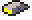
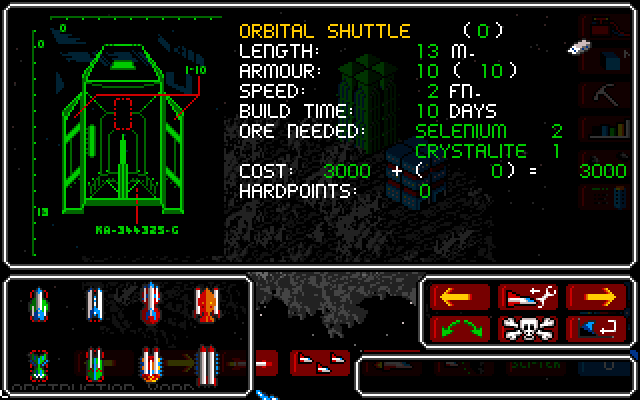
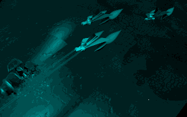
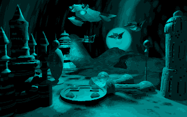

This page summarizes features that were removed from the game at one point or
another.

### Orbital Shuttle

{:.left}

A ship known as the Orbital Shuttle appears in the game data. The ship has
sprites, names, and game statistics, but it has no wireframe graphic for the
shipbuilding screen.

It is referred to by text string #126, which is the first of eight consecutive
strings of ship names. (Orbital Space Dock appears much later at string #173,
suggesting that was added later.) Despite not appearing in the game, its name is
translated.

- English: ORBITAL SHUTTLE
- French: VAISSEAU ORBITAL
- German: ORB.-TRANSPORTER

The Orbital Shuttle has an internal ID number of `1` (one before the Assault
Fighter, at `2`). It has following statistics:

- Armour: 10
- Speed: 2 FN. (equal to Scoutship)
- Hardpoints: 0
- Build time: 10 days
- Ore: 2 Selenium, 1 Crystalite
- Cost: 3,000 CD (equal to Scout Ship)
- Length: 13 m (equal to Assault Fighter)

Here's what it would look like if you could build it (note that it uses the
Assault Fighter wireframe):

{:.center}

It's a mystery what it was used for, since it has no weapons. Perhaps the
originally intended purpose was to transport population or ground troops. Alien
ship classes tend to mirror this layout of four small ships, two medium and two
large.

### Enemy ship detection

The [CU Amiga demo](../prototypes/cu-amiga-demo.html) notifies the player if an
enemy ship enters sensor range. The final release of the game doesn't do this.
However, there's still a sound file called `k240_3:speech/ENEMYVES.MGL` for this
event, which says "Enemy vessel detected".

The `bjork` sound test [cheat code](../game-mechanics/cheats.html) has two
entries for the next voice clip in the list, `EQUIPMAL.MGL` ("Equipment
malfunction"), which suggests that previously appeared in the sound test, but
was removed.

There's a likely reason why this alert was removed. When the enemy launches an
attack with ships, it is always in the form of a fleet, allowing the player the
chance to intercept it. Lone ships are only ever deployed in two circumstances:
Scoutships, and Transporters. These will never approach your colony deliberately
(although they may accidentally do so, such as if you and the alien both send
a Transporter to colonise the same asteroid and yours gets their first).

The alert was mostly useless, since individual alien ships are never actually
approaching you, only passing through your sensor range. There's also nothing
you can do about it, since you can't intercept individual ships that aren't part
of a fleet, so it's frustrating.

### Alternate win screen

| Standard win screen | Unused win screen |
|---------------------|-------------------|
|  |  |

As mentioned in [extracted images](../data/images.html), an alternate win screen
graphic appears on disk in the file `k240_3:outro3.mgl`. It appears likely that
it was intended to be used when the player defeats the Swixarans.

The game code has three strings containing the filenames of game over screens.
The first is `k240_3:outro1.mgl`, used upon defeating any alien but Swixaran.
The second is `k240_3:outro2.mgl`, used when the player is defeated. The third
is used when the player defeats the Swixarans, but it it set to the default win
screen, `k240_3:outro1.mgl`.

It seems likely that outro3 was intended to be used in the third slot, but was
unused for whatever reason. There are two leading theories to explain this:

1. The 3D render may not have been completed on time. Based on a screenshot of
the standard win screen in _The One Amiga_ #68 (May 1994) in its
[K240 review](https://amr.abime.net/review_9362), the review
copies of K240 distributed in March 1994 used `k240_3:satpic.mgl` as a stand-in
for the win screen graphic. This suggests that the 3D rendered win screens were
not completed until very late in development. It's plausible that outro3 was
temporarily replaced with outro1, and while outro3 was completed on time for
inclusion on disk, it was not completed on time to actually produce a new build
of the game executable, which may have required additional testing.
2. Outro3 may have caused issues due to its large filesize. Analysis of game
code suggests that the buffer used by the MGL decompression routine is 28,064
bytes. This is enough to hold the next-largest file, `outro2.mgl` (27,215 bytes
compressed), but `outro3.mgl` is 31,118 bytes compressed, probably due to the
amount of detail making it harder to compress well. It could therefore in theory
overrun the buffer, which would have unpredictable results.

Hex editing the game to change the second `outro1` to `outro3` works correctly.

### Missing alien ships and buildings

There are certain alien buildings and ships in the game code which they will
never actually build. The four hardest aliens all have their third small ship
class dummied out, and the easiest alien has a missing building.

Kll-Kp-Qua Science Hive
: {:.left}
The game code says that this operates the same as the Data Hive, which helps to
spot spy satellites. However, none of the building clusters include it, so it
wll never be built. One of the clusters attempts to build a non-existant
building in the Anti-Missile Pod slot, so it may be that the Science Hive was
meant to take that slot, although it could also be that Anti-Missile Pods were
removed to make the first alien easier.

Ax'Zilanth ship #3
: {:.left}
A small ship with 2 FN speed and 40 Armour. The ship's stats say it only has
two hardpoints, but it has four listed: a Photon Cannon, Warp Generator, Ion
Cannon, and a Disruptor.

Tylaran ship #3
: {:.left}
A small ship with 2 FN speed and 40 Armour. It has four hardpoints: Photon
Cannon, Laser Cannon, Ion Cannon, and Napalm Orb.

Rigellian ship #3
: {:.left}
A small ship with 2 FN speed and 40 Armour. Has four hardpoints: Laser Cannon,
Ion Cannon, Napalm Orb, and Photon Cannon. The Photon Cannon deals 0 damage
because the Rigellians do not have Photon technology.

Swixaran ship #3
: {:.left}
A small ship with 2 FN speed and 40 Armour. It has 4 hardpoints: Photon Cannon,
Ion Cannon, Napalm Orb, and Laser Cannon. The Laser Cannon deals 0 damage
because the Swixarans do not use Laser technology. The Swixarans also do not
normally use Napalm or any other fire-based weapons.

It's worth noting that for the two species that do use ship #3, they both have
oddities. The Kll-Kp-Qua's has 80 Armour and zero hardpoints, while the Ore
Eaters' is listed as having two hardpoints, but it has four hardpoints listed in
the stats. Perhaps a design change was made at some point to nerf these small
heavy ships.

### Planned features

According to [an interview](https://amr.abime.net/review_20463)
with the game's programmer Graeme Ing in _The One Amiga_ #59 (Aug 1993), various
planned features were cut from the game for technical reasons and time limits.

Targeting individual buildings
: It was initially intended that you could target individual buildings.
([_Amiga Action_ #28](https://amr.abime.net/review_36809) (Jan 1992))
_Dune II_ (1992) would establish this as as a standard feature of what would
would thereafter known as the real-time strategy genre. In _K240_, you can
only target specific asteroids with missiles or ships, but after that the
targeting is random.

Multiplayer
: _Populous_ (1989) featured null-modem multiplayer. For K240, however, the
amount of data necessary to transfer made this impractical. (_The One_ Aug 1993)

Scenario goals
: Originally, alien scenarios would have mission goals, which may be optional.
Examples given included destroying a shield generator, finding a certain
resource before the enemy does, (_The One_ Aug 1993) disabling convoys, and
locating bases. ([_Amiga Action_ Sept 1993](https://amr.abime.net/review_25444))
In the final game, only the Swixarans have a mission goal, to destroy asteroid
cloak generators.

Research
: According to [_Amiga Power_ #30](https://amr.abime.net/review_19688)
(Oct 1993), K240 would allow the player to acquire technology by scientific
research. The final game would have players buying technology blueprints from
Sci-Tek instead. Sci-Tek was already part of the game design by the time of the
[CU Amiga Mar 1994](https://amr.abime.net/review_29004) interview.
