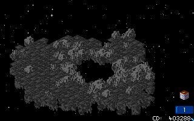

There are 24 asteroids in the game, although not all will be in play at any one
time. Each has a unique layout. The game dedicates 750 bytes per asteroid.

1. Table of Contents
{:toc}

### Starting ore

When generated, each asteroid has the following:

| Ore        | Chance | Min |   Max     |
|------------|-------:|----:|----------:|
| Selenium   |    80% | 500 | 100 (898) |
| Asteros    |    80% | 250 | 500       |
| Barium     |    60% | 250 | 500       |
| Crystalite |    80% | 250 | 750       |
| Quazinc    |    70% |  10 | 100       |
| Bytanium   |    50% |  10 | 100       |
| Korellium  |    50% |   1 |  50       |
| Dragonium  |    50% |  10 | 100       |
| Traxium    |    30% |   1 |  10       |
| Nexos      |    20% |   1 |   6       |

"Chance" is the percentage chance of any of this ore being found in the
asteroid. The amount of that ore is a random value between the minimum and
maximum inclusive.

For example, 50% of asteroids contain any Dragonium, and those which do will
have a minimum of 10 and a maximum of 100.

Selenium actually has a maximum of 100, which is less than its minimum of 500.
Due to the way RNG is calculated, this works out to a maximum of 898. See
[Bugs#Selenium calculation bug](../game-mechanics/bugs.html#selenium-calculation-bug)
for the specific formula which causes this.

All asteroids' ore count is generated when the asteroid is generated, which is
either at the beginning of the game, or when it appears mid-game (e.g. to
replace an asteroid destroyed in a collision). It's not determined when you
conduct the ore survey.

### Starting ore (home asteroid)

The exception to this algorithm is your starting asteroid, which always begins
with exactly the following amounts:

| Ore        | Amount |
|------------|-------:|
| Selenium   |   250  |
| Asteros    |   300  |
| Barium     |   300  |
| Crystalite |   100  |
| Quazinc    |    50  |
| Bytanium   |    50  |
| Korellium  |    25  |
| Dragonium  |    28  |
| Traxium    |     0  |
| Nexos      |     0  |

See [income and ore prices](../game-mechanics/income-and-ore-prices.html) for
the ore prices and how they are calculated.

### Asteroid direction and speed

All asteroids spawn with a random speed between 2 and 5.

|Speed| Chance | Chance % |
|:----|-------:|---------:|
|  2  |  6/16  | 37.50%   |
|  3  |  5/16  | 31.25%   |
|  4  |  3/16  | 18.75%   |
|  5  |  4/16  | 25.00%   |

The exceptions are your starting asteroid and the enemy's starting asteroid,
which always begin at zero speed. Your asteroid also begins with a temporary
free Gravity Nullifier effect to prevent early-game collisions.

There are 24 possible directions.

### Asteroid layouts

There are 24 unique asteroid layouts. When a new asteroid appears, it has to
pick one of the existing 24 asteroids which has yet to be instantiated. In other
words, if you have 24 asteroids and destroy your original colony, its
replacement is guaranteed to be the same shape as that asteroid.

You can occasionally see multiples of the same layout, but that is because some
of the patterns are duplicated in the list.

Since the game doesn't begin with the full set of 24 asteroids, it's rare to
actually see the higher asteroids. Some of them have really irregular shapes,
like the asteroid with a hole in it. The later ones also have a much larger
sprite on the space viewfield.

Asteroid 13 and 15 are particularly large (although there is a limit of 100
buildings per asteroid, but this still helps space buildings out for defensive
purposes if you don't have Screen Generator). 14 is a duplicate of the default
starting asteroid. 16 is oblong. 17 has a hole in the middle, which is
remarkable. 18 is very large. 19 looks like two smaller asteroids connected in
the middle by a bridge. 20 is kind of star-shaped, 21 is a large square shape,
22 is a huge triangle, and finally 23 is an absolutely huge asteroid with an
irregular outline.

For a list of some of the most interesting asteroid shapes, see
[Unlikely things: Rare asteroids](../fun/unlikely-things.html#rare-asteroids).

 
Asteroid #17, with a hole.
{:.center width="640" height="400"}
