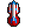
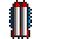
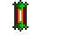
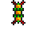
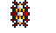

The exact effect and damage values of ship hardpoints are never stated in the
game or its manual. The following effects have been calculated by reading the
game code and testing.

I have not yet analyzed the exact area of effect and total damage values of
the more complicated ground fire-based weapons.

See also [missiles damage and effects](../game-mechanics/missiles.html).

1. Table of Contents
{:toc}

### Ship combat

Each ship has a cooldown which determines when its weapons fire. Each game tick,
the cooldown reduces by one, and the ship can fire when it reaches zero. It
decreases to -7, whereupon it resets to 16.

Ships fire all their hardpoints at one time, selecting random targets.

Ship damage is repaired only when there is a Repair Facility at the colony, only
if the ship is landed in a hangar, and only up to the base value without
shields.

### Ion Cannon

{:.left}
 
Has a 50% chance to shoot. Hits a random square for 5 damage.

### Disruptor

{:.left}
 
Has a 20% chance to shoot. Hits a larger area for 5 damage.

### Napalm Orb

{:.left}
 
Has a 20% chance to shoot. Sets a fire similar to a Napalm missile, which deals
5 damage and seems to do ongoing damage. Assuming it's similar to the Napalm
missile, it appears to deal 5 damage twice and 3 fire damage, per square, for 13
damage or 52 damage on a four-square building.

Against Swixarans, it deals base damage of 8 instead of 5.

### Chaos Bomb

{:.left}
 
Has a 20% chance to shoot. A larger 26-square fire with equivalent damage to
the Napalm Orb.

Against Swixarans, it deals base damage of 8 instead of 5.

### Vortex Mine

{:.left}
 
Has a 20% chance to shoot. Creates a Vortex storm which wanders the asteroid.
Like the Vortex missile, these vortex storms act randomly each game tick:

| Chance | Event     |
|-------:|:----------|
|   1%   | Divide in two, effectively spawning a second Vortex storm. |
|   3%   | Disappear. |
|  48%   | Deal 2 damage to the building at the current location, or 5 damage if the current enemy is Rigellians. |
|  48%   | Move. |

Alien Vortex Mine has a 10% chance to shoot.

Vortex deals 5 damage instead of 2 against Rigellians.

### Laser

{:.left}
 
Has a 30% chance to hit. Deals 2 damage.

### Photon Cannon

{:.left}
 
Has a 30% chance to hit. Deals 8 damage.

### Plasma Cannon

{:.left}
 
Has a 30% chance to hit. Deals 5 damage.

Despite costing twice as much, the Plasma Cannon deals less damage than the
Photon Cannon (9,000 vs 4,500 credits). This appears to be a
[bug](../game-mechanics/bugs.html). Photon being more powerful than Plasma is
consistent with the equivalent turrets.

Alien ship hardpoints deal different damage:

| Alien  | Laser | Plasma | Photon |
|:-------|------:|-------:|-------:|
| Player |     2 |      5 |      8 |
| Kll    |     2 |      4 |      6 |
| Ore    |     2 |      4 |      6 |
| Axz    |     3 |      5 |      8 |
| Tyl    |     4 |      6 |     10 |
| Rig    |     5 |      7 |      0 |
| Swi    |     0 |      7 |     11 |

Ship hardpoints deal the same damage as the equivalent turrets in all cases.
However, Turret Optimizer does not increase ship weapon damage.

### Static Inducer

{:.left}
 
Has a 10% chance to hit. Stops the target from firing by setting its weapon
cooldown to 100 ticks.

### Warp Generator

{:.left}
 
Switches on for three ticks, then off for two, meaning the ship is under the
effect 60% of the time. 

While the Warp Generator is on, all damage the ship takes is reduced to one
point. Even weapons which normally deal no damage, i.e. the Static Inducer, will
deal 1 damage.

Due to a bug, the Warp Generator has no effect when used by aliens. The code
which would check for it is missing.

### Deflector

{:.left}
 
If the ship has at least one deflector, all damage it takes is halved, rounded
down. Deflector is applied before Warp Generator.

### Shield x10, x20, x30, x40, x50

 
 
 
 

{:.left}

Simply raises the ship's maximum Armour (i.e. hit points). However, Repair
Facility will only repair a ship up to the maximum without shields.

Alien ships don't use shields, but only have the standard Armour value of their
ship class. There are entries for the five shields in the alien hardpoint list,
but they are unused.

### Alien hardpoint B

It appears to be some kind of weapon which causes the targeted ship to switch
its orders to "Patrol Asteroid".

Only used by the Kll-Kp-Qua and only on the smallest ship, which has a photon
cannon and this. The game code gives this ship internally as having only one
hardpoint, which would exclude Hardpoint B.

### Alien hardpoint C

Has a 10% chance to fire. A unique golden Vortex Mine, used exclusively by
Tylarans. One is used on their Terminator-class ship, and two on its Battleship.
It deals 4 damage on a hit instead of 2.

| Chance | Event     |
|-------:|:----------|
|   3%   | Divide in two, effectively spawning a second Vortex storm. |
|   5%   | Disappear. |
|  44%   | Deal 4 damage to the building at the current location. |
|  48%   | Move. |

### Alien hardpoint D

A power drain weapon used exclusively by Rigellians on their Terminator-class
ship. It causes the target colony's power production to decrease by 50%. It triggers on every fourth day, and lasts 4 days.

### Alien hardpoint E

A Swixaran bioweapon. Has a 10% chance to shoot. Reduces the population of the
target colony by 5. Used on three Swixaran ships, including the battleship.

### Alien hardpoint F

Swixaran self-destruct used exclusively on their large Transporter-class ship.

Once triggered, a hidden countdown decreases by one each time. When it reaches
50, it gives the message: "WARNING! THE LARGE ALIEN SHIP IS SUPERHEATING ITS
ENGINES!" At 20, it warns: "DANGER!! DANGER!! THE ALIEN ENGINES ARE TURNING
CRITICAL!!" At zero, it destroys the asteroid as if struck by a Mega missile.
