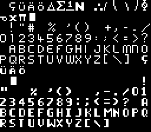

Occasionally, K240 fans will express interest in seeing the game re-made for a
modern audience, or perhaps just straight ported to modern PCs. But with the
benefit of thirty more years of game design, how would today's gamers view K240?

The following is a series of thoughts on the game design of K240.

### Summary

K240 is an early simulation and real-time strategy game which sees the player
manage a series of asteroid mining colonies in contested territory. Its
[design and development](../history/development.html) largely pre-dates
genre-defining RTS games like _Dune II_ and _Command & Conquer_, and as a result
it fails to live up to many expected conventions of that genre, particularly
with regards tactical gameplay.

At the same time, a lack of information given to the player constrains their
ability to make informed strategic decisions as one might in a simulation game.
This entire project, [Exploring K240](https://tetracorp.github.io/k240/), was
undertaken to reverse-engineer and document information hidden from the player,
and it's a long list.

Nevertheless, the core feeling of the gameplay is something interesting and
unique.

### Failures as an RTS

The 2023 article
[How To Make Good Small Games](https://farawaytimes.blogspot.com/2023/02/how-to-make-good-small-games.html)
posits that a game succeeds when it fulfils the player's expectations. By the
modern standard, K240 is a real-time strategy in the modern sense of the word,
although that term was not widely applied to K240 on its release in 1994 due to
the newness of the RTS genre.

The RTS is generally considered to have been defined by _Dune II_ (1992), which
drew on the core conflict in _Dune_ to make a game about building, resource
harvesting and micromanaged small-scale tactical warfare. Prior to this, the
term "real-time strategy" was used to describe a variety of games: _Creative
Computing_ magazine, September 1981, referred to _Empire_ as "a real-time,
strategy wargame of global conquest", while _The Book of Apple Software 1982_
used it to refer to the two-player Tron lightcycle style action game _Ultra
Blockade_.

Contemporary magazines generally did not interpret K240 as real-time strategy,
but rather as a simulation game like _SimCity_ (1989) with innovative combat
features, which is how the designers described K240's predecessor _Utopia_
(1991). K240 was also compared to the god game _Populous_ (1989), where the
player takes care of a population which it controls only indirectly by
manipulation of the population's environment.

As a result, K240 was highly praised in its day for innovating and exceeding its
expectations. A modern player, however, will naturally re-interpret K240 in the
context of the modern RTS genre and thirty years of game design features. In
that light, K240 appears ot have many weaknesses.

### Tactical controls

The fundamental failure of K240 as an RTS is its tactical controls.

_Dune II_, _Command & Conquer_, and _StarCraft_ all take place on a
two-dimensional plane, with most combat involving ground-based units. When a
player clicks to select a unit's destination, the spot selected is unambiguous.

However, K240 takes place in what is nominally three-dimensional space, with
all combat taking place between spaceships. It is therefore not possible to
unambiguously identify a position by click on a two-dimensional screen, and
as a result K240 lacks proper tactical combat micromanagement.

The localization of combat to asteroids also means that physical distance
between units is irrelevant. All units at an asteroid can attack all other units
at that asteroid.

All ships select targets entirely at random. This was primarily a limitation of
development time, but the user interface also makes this difficult. The game's
focus on building management makes it ambiguous whether you're clicking on a
ship or clicking to place a building. The game handles this by having a
different mouse pointer for ship mode, but the standard method to toggle the
pointer involves clicking through several menus (although there is a hotkey).

Even then, small ships zip around very quickly and present small mouse targets,
making them difficult to click on. An alternative is to click on the Landing Pad
building to select multiple ships, but these are easily destroyed and cannot be
placed at the edge of an asteroid, meaning they can become hidden behind other
buildings. This in turn necessitates a Tactical Mode which hides buildings.

The game handles combat better at the strategic level, where you can have up to
eight fleets and push them around the sector map like a war room board. However,
the tactical level provides limited player control. Ship combat in K240 is
mostly about playing the colony management aspect well enough to amass huge
numbers of ships to defeat the enemy by brute force.

### User interface

K240 featured an innovative and minimalist user interface. There was no
established user interface standard for this type of game yet, and many strategy
players enjoyed learning complex new games by reading by reading a large manual,
which in K240's case was over 28,000 words for the English version alone.
Players of pirate copies, supplied without the manual, found the game baffling.

Nowadays, where games are commonly sold either in DVD cases or digitally, thick
manuals are no longer the norm. To make the game easy to get into, user
interfaces are expected to be intuitive, which means the complete opposite of
innovative. Games teach their mechanics through tutorials, and K240's developers
later found it necessary to produce a tutorial video on VHS (now perhaps a lost
artifact; see [issue #1](https://github.com/tetracorp/k240/issues/1) if you have
a surviving copy of this).

{:.right}

There are other UI issues that wouldn't pass muster in a modern game. The font
is entirely uppercase. There is no text on UI buttons, and the publisher handled
this by including leaflet showing the button names. You often activate functions
by clicking on relevant buildings, but short buildings (especially Landing Pads)
are frequently hidden behind taller ones unless you are careful with the
asteroid layout. The construction window requires you to cycle through buildings
one at a time by clicking left and right, and the list is not sorted in any
particular order.

### What's good: the psychology of K240

The key experience of K240 is the klaxon of an incoming missile strike. 

The fog of war is K240 is severe. Sensors are limited to a short range around
each colony, and colonies are vulnerable to attack. A missile strike can appear
on the radar at any time and at short notice, creating a tension that underlies
the primary of gameplay of colony building.
An [intel system](../game-mechanics/intel.html) exists, but it is expensive and
unreliable.

When a missile strike does come in, the mode of gameplay quickly shifts to
disaster management. It's too late to build any defenses, so the game forces you
to watch as the buildings you carefully placed are smashed. During and after the
attack, you must take careful inventory of the buildings destroyed in order to
replace them, and in doing so must confront it.

A human bias, the [IKEA effect](https://en.wikipedia.org/wiki/IKEA_effect),
posits that people place increased value on something they built themselves.
This applies even if all you did was place the same standard air, food, and
water buildings as every colony, since your building positioning is still an act
of your own creation, and your awareness of the optimal buildings is a
reflection of player mastery of the game rules.

In other words, K240 is primarily a game of building amid the constant fear of
having your work destroyed, and being forced to stare directly at that
destruction. The enemy's location and strength are a secret, and attacking them
assures retaliation. The only way to win is the active and ruthless acquisition
of resources and technology.

It's reminiscent of the _WarGames_ or _DEFCON_ scenario of nuclear annihilation,
except that the game does not end with the missile exchange, but rather
continues and has you pick up the pieces. It's not just settlement management,
but disaster management, and that's an interesting concept for future game
designs to analyze.
